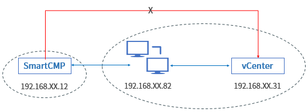
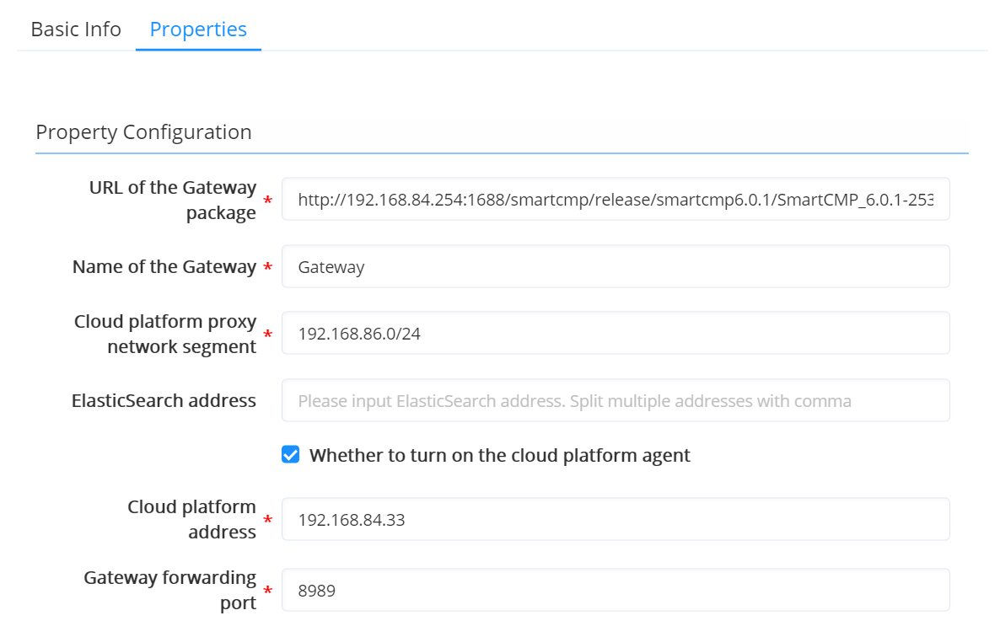

**Cloud Gateways**

# Functions
+ More and more enterprises adopt a hybrid cloud architecture. The underlying infrastructure and network environment of the enterprise are more complex and the distributed architecture adopted by SmartCMP can adapt to various scenarios, such as: multiple data centers; multiple VPCs, isolation of virtual network environment; hybrid cloud, including private cloud (data center) + public cloud.
+ By opening a limited communication port between CloudGateway and the master node, SmartCMP can use the cloud platform gateway to manage and monitor the resources of each VPC, data center or remote site in a unified manner.

# Typical application scenario
+ Typical application scenario of the cloud platform gateway is the network isolation problem when the gateway cannot support the complete SaaS mode, which leads to the disconnection of SmartCMP and the isolated data center network. For example, as shown in the following figure: SmartCMP is connected to the main data center network but not connected to the isolated center network. We need to use the network segment of the main data center to access the isolated data center. By installing a virtual machine with Gateway in the main data center, after the Gateway is successfully deployed, add proxy gateway to center's cloud platform to connect SmartCMP to the isolated data center. 

# The Role of Cloud Gateways
+ After the cloud gateway is installed:
    + Forward the request of the cloud resources in the isolated data center that the platform manages. For example, the cloud platform can send "install automation agent", "install monitoring agent", "execute script", "install software" and other requests to the corresponding cloud resources through CloudGateway, without directly connecting to each cloud resource under the isolated network.
    + Help the cloud platform to obtain monitoring data of cloud resources in the isolated data center. For example, the cloud platform can obtain monitoring data from cloud resources that have installed monitoring agents through CloudGateway, without directly connecting to every cloud resource under the isolated network.
    + Responsible for forwarding requests that cloud platform manages. Through CloudGateway, cloud resource life cycle management requests and resource status information acquisition requests are proxied to the cloud platform without directly connecting to the cloud platform.

# How to Install Cloud Gateway

## Multiple Installation Methods
+ The cloud platform provides multiple installation methods for software architects to choose according to their needs: 
    + In the blueprint design, add CloudGateway software components to an instance, apply for a service, and after the instance is deployed, the installation and configuration of CloudGateway will be automatically completed.
    + Dynamically add CloudGateway components to an instance node when applying for a service. After the instance is deployed, the installation and configuration of CloudGateway will be automatically completed.
    + Import an existing instance, install the automation agent, and then install CloudGateway software components.
    + After an instance has been deployed, after installing the automation agent, install CloudGateway software components through the operation interface of the instance.

## Installation Notes

+ Notes for software architects when installing CloudGateway cloud gateway components:
    + Operating system requirements: CentOS7.x/RHEL7.x. System requirements: CPU 4 cores, memory 16GB, disk 100GB (if the number of instances to be monitored is greater than 500, it should be appropriately increased).
    + The instance where CloudGateway is installed needs to have SSH service access permissions, and an SSH access user with sudo permissions is needed.
    + The instance needs to install an automation agent, and the installation process relies on the automation agent to execute the installation script.

## Specific Configuration Steps

+ Take the first installation method as an example ("Add CloudGateway software components to an instance in the blueprint design, apply for a service, and the instance will automatically complete the installation and configuration of CloudGateway") to introduce the configuration in detail step:

    + First of all, SmartCMP has built-in CloudGateway component in the component library. This component provides Nginx, Consul, Prometheus and other functions. Each Gateway component can only reverse the address of one cloud platform and monitor the API port of the cloud platform.
         

    + Blueprint designer can organize CloudGateway, virtual machine, and network in the blueprint visual editor, as shown in the following figure: two network components, one of which is the management network to ensure the connection between Gateway and CMP, and the other is a proxy network to ensure the connection between Gateway and data center.

           

    + In the service configuration, set the relevant parameters of the cloud platform gateway, including: the download path (the download path of the Ansible installation package of CloudGateway), cloud platform management address (isolated data center cloud platform address, 192.XX .XX.33), the proxy network segment (the network segment 192.XX.XX.1 and port 8989 of the network that the cloud platform can connect to CloudGateway) and whether to enable the cloud platform proxy (whether to enable CloudGateway to have this function, that is, cloud Resource life cycle management requests and resource status information acquisition requests are proxied to the cloud platform without directly connecting to the cloud platform).
        
         

    + After the configuration is completed, publish to the service catalog for self-service. After the instance deployment is completed, the installation and configuration of CloudGateway will be automatically completed.

    + After the installation is successful, the component will appear in the cloud resource software list and the menu list of "Infrastructure"-"Cloud Gateways" (only tenant administrators and IaaS administrators have permission to view), you can view the list to get the CloudGateway name , IP address, and creation time. At the same time, in the service deployment, you can view the information of the successfully deployed cloudvgateways, and perform changes and operations such as refreshing status, stopping, installing software, and deleting.

    + When the cloud platform gateway is installed in the data center of the isolated network, the administrator needs to go to the "Infrastructure"-"Cloud Entries"-the cloud platform of the isolated data center (for example, the cloud platform of the isolated data center mentioned above, 192.XX.XX.33), associate CloudGateway, enter the gateway information (leave blank by default, this information matches the gateway information configured in the service configuration, such as: gateway port 8989 is consistent).
