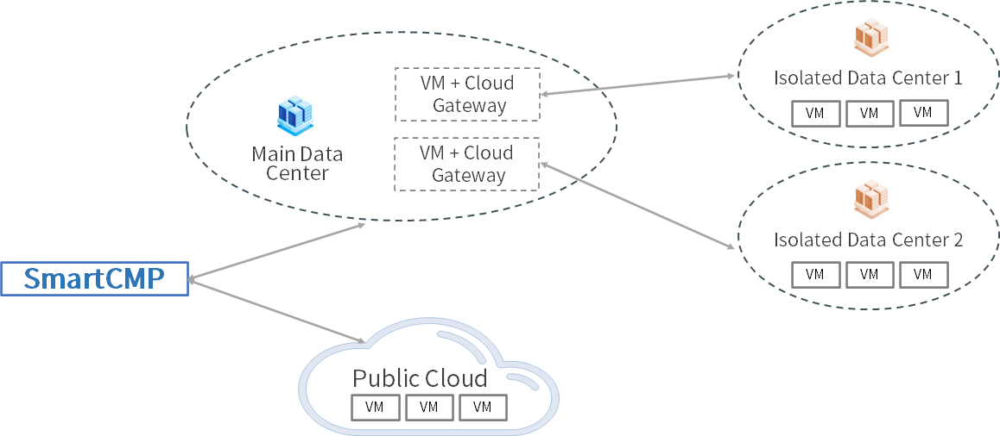

**Cloud Gateways**
More and more enterprises adopt a hybrid cloud architecture. The underlying infrastructure and network environment of the enterprise are more complex and the distributed architecture adopted by SmartCMP can adapt to various scenarios, such as: multiple data centers; multiple VPCs, isolation of virtual network environment; hybrid cloud, including private cloud (data center) + public cloud.
+ By opening a limited communication port between CloudGateway and the master node, SmartCMP can use the cloud platform gateway to manage and monitor the resources of each VPC, data center or remote site in a unified manner.
+ Typical application scenario of the cloud platform gateway is the network isolation problem when the gateway cannot support the complete SaaS mode, which leads to the disconnection of SmartCMP and the isolated data center network. For example, as shown in the following figure: SmartCMP is connected to the main data center network but not connected to the isolated center network. We need to use the network segment of the main data center to access the isolated data center. By installing a virtual machine with Gateway in the main data center, after the Gateway is successfully deployed, add proxy gateway to center's cloud platform to connect SmartCMP to the isolated data center.

+ The specific implementation steps are described below:

    + First of all, SmartCMP has built-in CloudGateway component in the component library. This component provides Nginx, Consul, Prometheus and other functions. Each Gateway component can only reverse the address of one cloud platform and monitor the API port of the cloud platform.
    + Blueprint designer can organize CloudGateway, virtual machine, and network in the blueprint visual editor, as shown in the following figure: two network components, one of which is the management network to ensure the connection between Gateway and CMP, and the other is a proxy network to ensure the connection between Gateway and data center.
    
       

    + In the service configuration, set the relevant parameters of the cloud platform gateway, including: the download path (the download path of the Ansible installation package of CloudGateway), the gateway (the gateway of the network that SmartCMP and main data center can connect), the proxy network segment (the network segments that SmartCMP and main data center can connect) and other information.

    + After the installation is successful, the component will appear in the list of cloud resource software, and the cloud gateway menu has also been added, which is placed in Infrastructure - Cloud Gateways. It is necessary to associate the cloud gateway with the data center cloud platform of the isolated network to open the link between SmartCMP and the isolated data center.

    + Also, in the service deployment, users can view the cloud gateway information that has been successfully deployed, and perform operations such as refreshing the status, stopping, installing software, and deleting.
