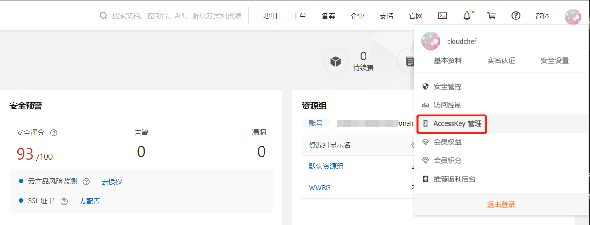
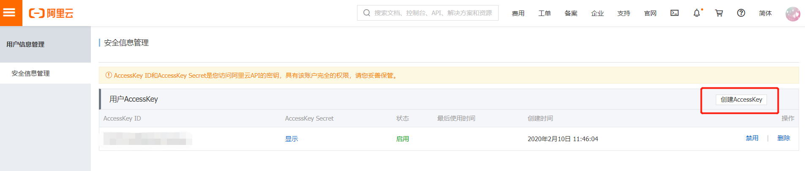
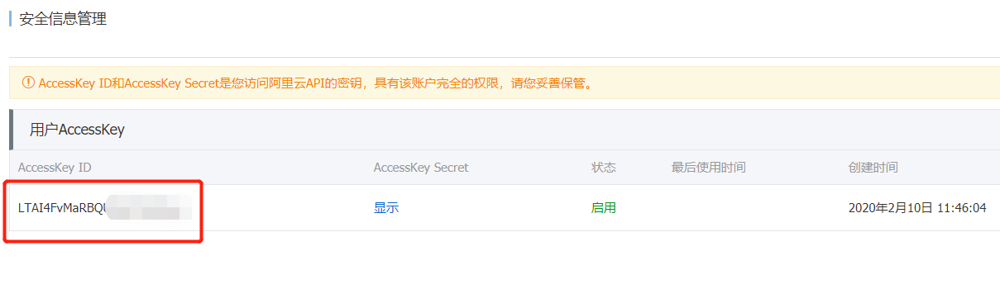
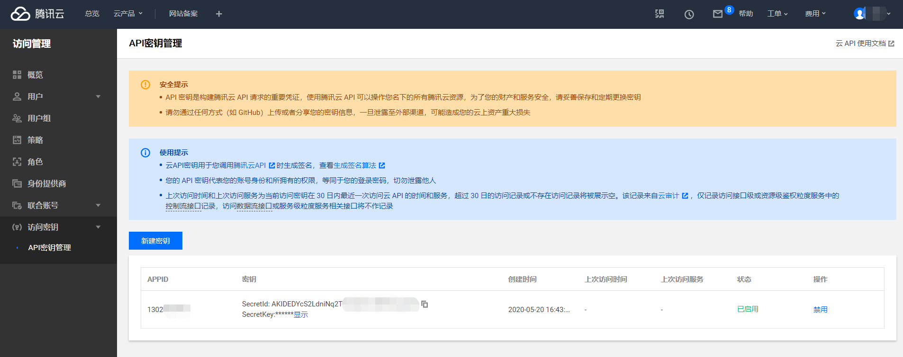
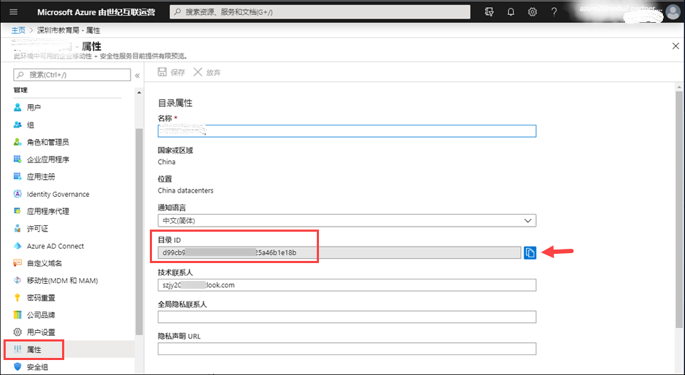
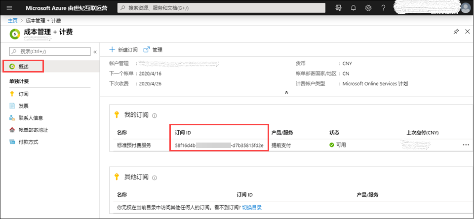
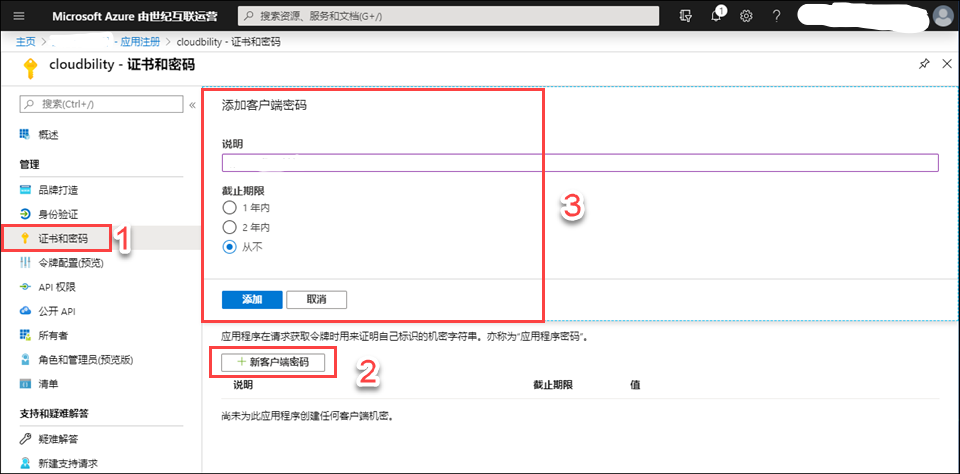

**Cloud Platform Management**

System administrators and tenant administrators can add vSphere, VMware NSX, OpenStack, PowerVC, Hyper-V, EMC SCP, NFS, physical servers, Kubernetes, Docker, NFS, Aliyun, Tencent Cloud, QingCloud, AWS, Azure, Kingsoft, SmartX, UCloud, ZStack and other cloud platforms from different vendors, as well as F5 load balancer and ACI network in Infrastructure - Cloud Entries. The cloud platform can also be edited and deleted after it is created.

# Add a Cloud Platform

When connecting the cloud platform, in order to ensure the security of the virtual machine, the public cloud (including Alibaba Cloud, Tencent Cloud, AWS) needs to verify the identity of the visitor when the API is called to ensure that the visitor has relevant permissions. The public cloud verification method is implemented by the Access Key. The access key is issued by the cloud platform to the owner of the virtual machine consisting of Access Key ID and the Access Key Secret. 

## Add vSphere Cloud Platform {#Add vSphere Cloud Platform}

You can add a vSphere cloud platform by following the steps: 

1.  Go to "Infrastructure" - "Cloud Entries", select "vSphere"

2.  Click "Add" and enter the required parameters：

|Parameter|               Description |                                  Example|
|:------:|:------:|:-----:|
|Cloud name|                 vSphere cloud platform name |                      A\--vCenter|
|  Username|                 vSphere Username  |                         administrator\@vsphere.local
|  Password |                  vSphere Password|                             Confirm Password|   
|URL|                   vSphere API URL|                         192.168.x.x|
|  Port|                   API port  |                               443|
| Data Center|               Data center location|                          Shanghai|
| Connect VMware NSX|   NSX cloud platform (need to add VMware platform first)|   Select the corresponding NSX cloud platform name|

3.  Click Verify, after the verification is successful, click “Submit” and the vSphere virtualization platform is successfully connected.

## Add VMware NSX Cloud Platform {#Add VMware NSX Cloud Platform }

You can add a VMware NSX cloud platform by following the steps:

1. Go to "Infrastructure" - "Cloud Entries", select "VMware NSX"

2. Click "Add" and enter the required parameters：

Parameter|   Description|            Example
:------:|:------:|:-----:
Name|       VMware NSX name|   NSX
URL|       VMware NSX address|   192.168.xx.xxx
Username|     Username|           admin
Password|       Password |           Confirm Password    

3.  Click Verify, after the verification is successful, click “Submit” and the VMware NSX virtualization platform is successfully connected.

>「Note」The use of VMware NSX must be based on the addition of the vSphere cloud platform. After adding the vSphere cloud platform and the VMware NSX platform successfully, the NSX needs to be associated in the vSphere cloud platform. 

## Add OpenStack Cloud Platform {#Add OpenStack Cloud Platform}

You can add an OpenStack cloud platform by following the steps:

1.  Go to "Infrastructure" - "Cloud Entries", select "OpenStack"

2.  Click "Add" and enter the required parameters：

Parameter |  Description |                       Example|
    :------:|:------:|:-----:
  Cloud name|     OpenStack cloud platform name     | OpenStack
  Authentication URL|    OpenStack keystone authentication URL | http://xxx.xxx.xxx.x:500/v2.00
  API version|    Select API version  | Version 2
  Tenant name|   Tenant name                   |admin
  Username|    Username                     | admin
  Password |      Password                        |Confirm password         
  Region|       Region name                    |RegionOne
  Data Center | Data center location              |Shanghai

3.  Click Verify, after the verification is successful, click “Submit” and the OpenStack virtualization platform is successfully connected.

## Add PowerVC Cloud Platform {#Add PowerVC Cloud Platform}

You can add a PowerVC cloud platform by following the steps:

1.  Go to "Infrastructure" - "Cloud Entries", select "PowerVC"

2.  Click "Add" and enter the required parameters：

Parameter|         Description|                         Example
 :------:|:------:|:-----:
  Cloud name|            PowerVC cloud platform name  |          Power
  Authentication URL |          PowerVC Authentication URL |              http://xxx.xxx.xxx.x:500/v2
  Disable SSL Verification |  Disable_ssl_verification|  Optional, authentication URL (optional for HTTPS)
  Project name |         Project name   |              admin
  Project domain name  |          Project domain name |         Default
  Username|    Username                     | admin
  Password |      Password                        |Confirm password               
  User domain|            User domain |                 default
  Region|       Region name                    |RegionOne
  Data Center | Data center location              |Shanghai

3.  Click Verify, after the verification is successful, click “Submit” and the PowerVC virtualization platform is successfully connected.

## Add Hyper-V Cloud Platform  {#Add Hyper-V Cloud Platform}

You can add a Hyper-V cloud platform by following the steps:

1.  ①	Go to "Infrastructure" - "Cloud Entries", select "Hyper-V"

2.  ②	Click "Add" and enter the required parameters:

3.  ③	Click Verify, after the verification is successful, click “Submit” and the Hyper-V virtualization platform is successfully connected. 

Parameter|         Description|                         Example
:------:|:------:|:-----:
Cloud name  |         Hyper-V Cloud name  | Hyper-V
SCVMM address |       Hyper-V SCVMM Address |  http://x.x.x.x:5985/wsman
SCVMM name |       Hyper-V SCVMM name|   scvmm01.test.local
VM storage path|   VM storage path  |    C:\\ClusterStorage\\Volume1
Username  |         Hyper-V Username|      administrator\@wintest
Password    |         Hyper-V Password | Confirm password  

## Add CloudView Platform {#Add CloudView Platform}

You can add a CloudView cloud platform by following the steps:

1.  Go to "Infrastructure" - "Cloud Entries", select "CloudView"

2.  Click "Add" and enter the required parameters:

Parameter|         Description|          Example
 :------:|:------:|:-----:
  Cloud name |    CloudView cloud platform name          | CloudView
  Authentication URL |  Authentication URL                   |Authentication URL
  API version|    Select API version  |Version 2
  Tenant name|   Tenant name                   |Tenant
  Username|     Username                    | admin
  Password|      Password                      |  Confirm password            
  Region  |     Region                    | RegionOne
  Data Center|   Data center location          |上海

3.  Click Verify, after the verification is successful, click “Submit” and the CloudView virtualization platform is successfully connected.

## Add Physical Host Cloud Platform {#Add Physical Host Cloud Platform}

You can add a Physical Host cloud platform by following the steps:

1.  Go to "Infrastructure" - "Cloud Entries", select "Physical Host"

2.  Click "Add" and enter the required parameters:

Parameter|         Description|          Example
 :------:|:------:|:-----:
  Cloud name  |   Physical Host name |  X86 Physical Host
  Authentication URL |   Authentication URL |         http://x.x.x.x
  Username|     Username                    | admin
  Password|      Password                      |  Confirm password  

3.  Click Verify, after the verification is successful, click “Submit” and the Physical Host virtualization platform is successfully connected.

## Add Kubernetes Cloud Platform {#Add Kubernetes Cloud Platform}

You can add a Kubernetes Cloud Platform by following the steps below:

1.  Go to "Infrastructure" - "Cloud Entries", select "Kubernetes"

2.  Click "Add" and enter the required parameters:

 + Name: Enter the cloud platform name of Kubernetes

 + Authentication URL: Enter the URL information of the cloud platform

 + CA certificate: In the kubectl configuration file, find the certificate-authority file in .kube/config

 + User certificate: In the kubectl configuration file, find the client-certificate file in .kube/config

 + Prometheus monitoring address: If Prometheus is installed in Kubernetes, you can enter the Prometheus monitoring address and view the Kubernetes monitoring data via the SmartCMP platform.

 + Prometheus monitoring address: If Prometheus is installed in Kubernetes, you can enter the Prometheus monitoring address and view the Kubernetes monitoring data via the SmartCMP platform.

3.  Click Verify, after the verification is successful, click “Submit” and the Kubernetes virtualization platform is successfully connected

4. Container Image Source page: Add, edit, delete container image source

+ Add container image source: Select the type (VMware Habor, Docker Trusted Registry), fill in the name, project name (VMware Habor type), URL and other related information and fill in the description. If the image belongs to the public image, you do not need to fill in the username and password but if the image belongs to a private image, you need to fill in the username and password to verify the success. 

+ Edit container image source: Select an image and click “Edit” to modify it.

+ Delete container image source: Select an image and click “Delete” to delete the mirror source.

## Add Docker Cloud Platform {#Add Docker Cloud Platform}

You can add a Docker cloud platform by following the steps:

1.  Go to "Infrastructure" - "Cloud Entries", select "Docker"

2.  Click "Add" and enter the required parameters:

Parameter|         Description|          Example
  :------:|:------:|:-----:
  Cloud name|    Docker cloud platform name|   Docker
 Transfer Protocol|  Transfer Protocol   |        http
  Remote URL|    Remote URL |           http://x.x.x.x
  Port |      Port   |            2375

3.  Click Verify, after the verification is successful, click “Submit” and the Docker virtualization platform is successfully connected.

## Add NFS Cloud Platform {#Add NFS Cloud Platform}

You can add a NFS cloud platform by following the steps:

1.  Go to "Infrastructure" - "Cloud Entries", select "NFS"

2.  Click "Add" and enter the required parameters:

Parameter|         Description|          Example
   :------:|:------:|:-----:
  Cloud Name   |  NFS Cloud Platform Name  |   NFS
  NFS Server  | NFS Server   |     http://x.x.x.x
  Username   |   Username    |        Username
  Password    |    Password      |        Password
  Confirm password |   Confirm password  |    Password

3.  Click Verify, after the verification is successful, click “Submit” and the NFS virtualization platform is successfully connected.

## Add Aliyun Cloud Platform {#Add Aliyun Cloud Platform}

You can add an Aliyun cloud platform by following the steps:

  Go to "Infrastructure" - "Cloud Entries", select "Aliyun"

  Click "Add" and enter the required parameters:

Parameter|         Description|          Example
  :------:|:------:|:-----:
  Cloud Name    |  Aliyun Cloud Platform Name |  Aliyun
  Access Key ID |  Aliyun Access Key ID  | 
  Access Key Secret   |  Aliyun Access Key Secret   |  

  Aliyun AccessKey acquisition method

>「Note」  For security reasons, visitors need to verify their identity when calling Alibaba Cloud's API, and verify the Access Key to ensure that the visitor has relevant permissions. Get Access Key Secret:Log in to your Aliyun Cloud Management Console, click on the personal information in the upper right corner of the page, expand the panel, select "access keys".

>「Note」 or you can log in directly to <https://ak-console.aliyun.com> and enter the Access Keys management interface to view your Access Key list. If the current list is empty, you can also create one. When creating a new AccessKey, Alibaba Cloud will send a verification code to the account contact's phone.

>「Note」 Get Access Key ID:Aliyun Cloud Account ID is the unique identifier assigned to each user by Aliyun Cloud. It cannot be changed. If the user wants to view his or her Ali cloud account ID, please visit the Aliyun account "Security Settings" in the login status, address:<https://account.console.aliyun.com/secure>. Find your account ID on the Security Settings page.

4.  Click Verify, after the verification is successful, click “Submit” and the Aliyun virtualization platform is successfully connected.

 

## Add Apsara Stack Cloud Platform {#Add Apsara Stack Cloud Platform}

You can add a Apsara Stack cloud platform by following the steps:

1.  Go to "Infrastructure" - "Cloud Entries", select "Apsara Stack"

2.  Click "Add" and enter the required parameters:

Parameter|         Description|          Example
:------:|:------:|:-----:
Cloud Name|       Apsara Stack Cloud Platform Name|   Aliyun专有云
Access Key ID|  Apsara Stack Access Key ID|     
Access Key Secret |    Apsara Stack Access Key Secret   |      

3.  Click Verify, after the verification is successful, click “Submit” and the Apsara Stack virtualization platform is successfully connected.

## Add Tencent Cloud Platform {#Add Tencent Cloud Platform}

You can add a Tencent cloud platform by following the steps:

1.  Go to "Infrastructure" - "Cloud Entries", select "Tencent"

2.  Click "Add" and enter the required parameters:

Parameter|         Description|          Example
    :------:|:------:|:-----:
  Cloud Name     |  Tencent Cloud Platform name|   TenantCloud
  Access Key ID |  Tencent Access Key ID  | 
  Access Key Secret |    Tencent Access Key Secret   |  
  Region   |      Region Name  |        Eastern China

3.  Like Aliyun Access Key, Tencent Cloud provides an API key verification mechanism for API services. The API key is issued by Tencent Cloud to the owner of the virtual machine. It consists of Secret ID and Secret Key, corresponding to the access key ID and access key of SmartCMP accessing to Tencent cloud platform.
  

>「Note」  Acquisition method: Log in to your Tencent Cloud console, click on “Cloud Products” in the upper left corner, click on “Cloud API Key” in the pop-up interface, or you can log in directly to https://console.qcloud.com/capi. Go to the “Cloud API Key” management interface and you will see your API key list. The API key consists of APP ID, Secret ID and Secret Key. If the list is empty, please click “New Key” to create one.

>「Note」    Tencent Cloud Account ID is the unique identification code assigned to each user by Tencent Cloud. To view your own Tencent Cloud account ID, please visit “Account Information” in the login status. Address: https://console.qcloud.com/developer

4.  Click Verify, after the verification is successful, click “Submit” and the Tencent virtualization platform is successfully connected.

## Add QingCloud Platform {#Add QingCloud Platform}

Support connection to both QingCloud public and private cloud platform. You can add a QingCloud cloud platform by following the steps:

1.  Go to "Infrastructure" - "Cloud Entries", select "QingCloud"

2.  Click "Add" and enter the required parameters:

Parameter|         Description|                        Example
 :------:|:------:|:-----:
  Cloud Name |      QingCloud Platform name|                          QingCloud
  Access Key ID|   QingCloud Access Key ID |                         
  Access Key Secret  |   QingCloud Access Key Secret|                         
  Type    |     Choose Private or Public  |                        Private/Public
  API URL |     If private, you need to provide QingCloud private cloud API URL |  http://x.x.x.x

3.  Similar to Aliyun Cloud Access Key, QingCloud Public Cloud provides a set of API key verification mechanism for API services. Through this key, users can import cloud resources in QingCloud to the platform. The API key is issued by QingCloud to the owner of the virtual machine, which consists of qy_access_key_id and qy_secret_access_key.

>「Note」    Log in to your QingCloud console, click on “API Key” in the left menu to enter the API Key Management page, or you can log in directly to [https://console.qingcloud.com/access_keys/](https://console.qingcloud.com/access_keys/). Click the Create button, the “New API Key” window will pop up, enter the name, such as: cloud service, click the “Submit” button. In the pop-up "Download Key" window, click the Download button and download the key file: access_key.csv to the local. Please note that the download link for the API key will only appear once, if you did not download it when you created it, please re-create a new API key. Open the file with Notepad: access_key.csv, you can see the API key information: qy_access_key_id and qy_secret_access_key

4. Click Verify, after the verification is successful, click “Submit” and the QingCloud virtualization platform is successfully connected.

## Add AWS Cloud Platform {#Add AWS Cloud Platform}

You can add an AWS cloud platform by following the steps:

1.  Go to "Infrastructure" - "Cloud Entries", select "AWS"

2.  Click "Add" and enter the required parameters:

Parameter|         Description|          Example
:------:|:------:|:-----:
  Cloud Name  |     AWS Cloud Name |    AWS
  Access Key ID |  AWS Access Key ID |  
  Access Key Secret |    AWS Access Key Secret     |

3.  Amazon AWS access key (Access Key) is a credential for AWS users to confirm user identity when accessing cloud resources through API. SmartCMP manages AWS cloud resources through API, so users need to obtain AWS access key first. The Access Key is issued by Amazon AWS to the owner of the virtual machine. It consists of the Access Key ID and the Secret Access Key. 

>「Note」  Log in to the management console using the AWS primary account (or a sub-account with Administrator Access management policy permissions), and click on "Identity & Access Management" in Security & Identity to enter the IAM Control Panel. After entering the IAM control panel, click on "Users" to view a list of all users.

>「Note」  View user security certificate: To import cloud resources into the platform, make sure that the Access Key has sufficient resource permissions. Select a user with the appropriate permissions, click on the username, enter the user details page, and click on "Security Certificate". Create an access key: Please click "Create Access Key" to open the key information window. It should be noted that in the AWS console, the user only has one chance to view the access key, so be sure to save the key information after creating the access key successfully. The access key ID in the figure is the Access Key ID used when importing the virtual machine, and the private access key is the Secret Access Key (the default is not displayed, click the “Show” link)

4.  Click Verify, after the verification is successful, click “Submit” and the AWS virtualization platform is successfully connected.

## Add Azure Cloud Platform {#Add Azure Cloud Platform}

You can add an Azure cloud platform by following the steps:

1.  Go to "Infrastructure" - "Cloud Entries", select "Azure"

2.  Click "Add" and enter the required parameters:

Parameter|         Description|          Example
:------:|:------:|:-----:
  Cloud Name   |  Azure Cloud Name|   Azure
  Client ID |  Azure Client Address|   
  Access Key | Tenant name     |   ma
  Access domain  |   Username     |      
  Subscription ID  |      |          

Microsoft Azure's API access credentials need to be obtained in multiple steps. It consists of a subscription ID, a client ID, and an access key.
 

  Get the access domain of Microsoft Azure:

>「Note」  Enter Azure Active Directory in the Azure console, and then click the secondary menu "Properties"; In the Active Directory property page, we can see "Directory ID", which is the access domain of Azure.

  Get the subscription ID: 

>「Note」  Before you can purchase an Azure product, you must first create a subscription, and then you need to purchase cloud resources under this subscription. Cloud resources cannot be accessed across subscriptions. Therefore, when you have multiple subscriptions, please make sure that the subscription ID you entered is the subscription to the cloud resource you need to import, otherwise you may not be able to list the cloud resources. Log in to the Azure console and select “Cost Management + Billing” on the left menu (the menu order is customizable). In “Overview”, find the subscription to which you want to import the cloud resource and get the “Subscription ID”. If you have multiple subscriptions and want to manage them through the platform, create multiple cloud accounts for batch import.

 Get the client ID and the access key:

>「Note」 In [Azure Active Directory], click the secondary menu "[Application Registration]", all existing applications will be listed, and the client ID can be found at the application (client) ID. Click the application to enter the details On the page, first click the "[Certificate and Password]" button on the left, then find the "Add Client Password" on the right, add the client password, and after adding it successfully, you can view the access key. 

Click Verify, after the verification is successful, click “Submit” and the Azure virtualization platform is successfully connected.

## Add F5 BIG-IP Cloud Platform {#Add F5 BIG-IP Cloud Platform}

You can add a F5 BIG-IP cloud platform by following the steps:

1.  Go to "Infrastructure" - "Cloud Entries", select "F5 BIG-IP"

2.  Click "Add" and enter the required parameters:

Parameter|         Description|          Example
:------:|:------:|:-----:
  Cloud Name  |          F5 BIG-IP Cloud Platform Name |  F5 BIG-IP
 Authentication URL |          F5 BIG-IP Authentication URL  |    https://192.168.1.171
  Username|            Username           |     Admin
  Password|              Password |                       Confirm Password        

3.  Click Verify, after the verification is successful, click “Submit” and the F5 BIG-IP virtualization platform is successfully connected.

## Add CISCO ACI Cloud Platform {#Add CISCO ACI Cloud Platform}

You can add a CISCO ACI cloud platform by following the steps:

1.  Go to "Infrastructure" - "Cloud Entries", select "CISCO ACI"

2.  Click "Add" and enter the required parameters:

Parameter|         Description|          Example
:------:|:------:|:-----:
  Cloud Name |      CISCO ACI Cloud Name |  CISCO ACI Platform
  Authentication URL |   CISCO ACI Authentication URL |   http://x.x.x.x:5000/
  Tenant Name|   Tenant Name           |   Tenant
  Username|     Username       |      Username
 Password |      Password               |  Confirm Password       

3.  Click Verify, after the verification is successful, click “Submit” and the CISCO ACI virtualization platform is successfully connected.

##  Add Kingsoft Cloud Platform {#Add Kingsoft Cloud Platform}

You can add a Kingsoft cloud platform by following the steps:

1.  Go to "Infrastructure" - "Cloud Entries", select "Kingsoft"
2.  Click "Add" and enter the required parameters:

Parameter|         Description|          Example
:------:|:------:|:-----:
Cloud Name|Kingsoft Cloud Name|Kingsoft
Access Key ID|Kingsoft Access Key ID| Similar to [Aliyun](https://cloudchef.github.io/doc-en/AdminDoc/03Infrastructure/CloudPlatformManagement.html#Add%20Aliyun%20Cloud%20Platform)
Access Key Secret|Kingsoft Access Key Secret|Similar to [Aliyun](https://cloudchef.github.io/doc-en/AdminDoc/03Infrastructure/CloudPlatformManagement.html#Add%20Aliyun%20Cloud%20Platform)

3.  Click Verify, after the verification is successful, click “Submit” and the Kingsoft cloud platform is successfully connected.

# View the Cloud Platform Added by the Current Tenant

You can follow the steps below to view the cloud platform that the current tenant has added:

1.  On the left navigation select “Infrastructure” - “Cloud Platform Management”

2.  Select cloud platform on the left side, and you will see the added cloud platform information on the right side.

3.  Add, edit, and delete the cloud platform on this page

4.  Click the name of the cloud platform to enter the “Overview” interface of the cloud platform. Click the “Resource Information” tab to view the overall resource usage of the cloud platform.

# Modify Cloud Platform Information  

In the left navigation, select "Infrastructure" - "Cloud Entries", select the cloud platform type to be modified in the left management menu, then click the cloud platform name on the right or select the cloud platform and click "Edit", then the cloud platform appears. Edit interface. After modifying the cloud platform information, click "Verify" - "Submit".

# View Cloud Platform Resource Usage

After the cloud platform is successfully added, you can view the total resource usage of the cloud platform through the system. On the left navigation, select "Infrastructure" - "Cloud Entries" to view resource usage based on the selected cloud platform

## View Resource Usage of the vSphere Cloud Platform {#View Resource Usage of the vSphere Cloud Platform}

After adding the vSphere cloud platform successfully, click the cloud platform name or select the cloud platform and click “Edit” to enter the “Overview” page of the cloud platform. Click “Resource Information” to display the overall resource status of the current vSphere cloud platform:

 + Overview: Displays the resource profiles under the cloud platform, such as the number of physical hosts, the number of clusters, the number of datastores, the number of standard switches, and the total number of virtual machines

 + Data Center Profile: Shows the percentage of used and total number of clusters, hosts, virtual machines, CPU, memory, storage, etc. 

 + Cluster and Host Profile: Displays the cluster name, the cloud host name under the cluster, the data center to which it belongs and the percentage of used and total number of CPUs, CPU, memory and storage

 + Data Storage Profile: Shows the datastore name, the data center to which it belongs, and the percentage of used, total, and total applied amount of storage

 + vSphere Resource Bundle Profile: vSphere resource pool name, cluster to which it belongs, percentage of used and total CPU and percentage of used and total memory 

## View OpenStack Cloud Platform Resource Usage {#View OpenStack Cloud Platform Resource Usage}

After adding the OpenStack cloud platform successfully, click the cloud platform name or select the cloud platform and click “Edit” to enter the “Overview” page of the cloud platform. Click “Resource Information” to display the overall resources of the current OpenStack cloud platform: including available Zone name, total number of resource bundles, deployed virtual machines, CPU, memory, storage, and more.	

## View PowerVC Cloud Platform Resource Usage {#View PowerVC Cloud Platform Resource Usage}

After adding the PowerVC cloud platform successfully, click the cloud platform name or select the cloud platform and click “Edit” to enter the “Overview” page of the cloud platform. Click “Resource Information” to display the overall resources of the current PowerVC cloud platform: including available Zone name, total number of resource bundles, deployed virtual machines (deployed/reserved total), CPU, memory, storage, and more.

## View Kubernetes Cloud Platform Resource Usage {#View Kubernetes Cloud Platform Resource Usage}

After adding the Kubernetes cloud platform successfully (you need to install Prometheus in Kubernetes and enter the Prometheus monitoring address in the cloud platform), click on the cloud platform name or select the cloud platform and click "Edit", you will enter the cloud platform "Overview" page, click "resource information” and the overall resources of the current Kubernetes cloud platform will be displayed including cluster memory usage, cluster CPU usage, and cluster file system usage.

## View the Resource Usage of Alibaba Cloud Platform {#View the Resource Usage of Alibaba Cloud Platform}

After adding the Aliyun Cloud platform successfully, click on the cloud platform name or select the cloud platform and click “Edit” to enter the “Overview” page of the cloud platform. Click “Resource Information” to display the overall resources of the current Alibaba Cloud platform: including the area name, total number of configured resource bundles, deployed virtual machines (deployed/reserved total), CPU (used/reserved total), and memory (used/reserved total). 

## View the Resource Usage of Tencent Cloud Platform {#View the Resource Usage of Tencent Cloud Platform}

After adding the Tencent Cloud Platform successfully, click on the cloud platform name or select the cloud platform and click “Edit” to enter the “Overview” page of the cloud platform. Click “Resource Information” to display the overall resources of the current Tencent Cloud Platform: including the area name, total number of configured resource bundles, deployed virtual machines (deployed/reserved total), CPU (used/reserved total), and memory (used/reserved total).

## View the Usage of QingCloud Platform Resources {#View the Usage of QingCloud Platform Resources}

After adding the QingCloud platform successfully, click on the cloud platform name or select the cloud platform and click “Edit” to enter the “Overview” page of the cloud platform. Click “Resource Information” to display the overall resources of the current QingCloud platform: including the area name, total number of configured resource bundles, deployed virtual machines (deployed/reserved total), CPU (used/reserved total), and memory (used/reserved total).

## View AWS Cloud Platform Resource Usage {#View AWS Cloud Platform Resource Usage}

After adding the AWS platform successfully, click on the cloud platform name or select the cloud platform and click “Edit” to enter the “Overview” page of the cloud platform. Click “Resource Information” to display the overall resources of the current AWS platform: including the area name, total number of configured resource bundles, deployed virtual machines (deployed/reserved total), CPU (used/reserved total), and memory (used/reserved total).

## View Azure Cloud Platform Resource Usage {#View Azure Cloud Platform Resource Usage}

After adding the Azure platform successfully, click on the cloud platform name or select the cloud platform and click “Edit” to enter the “Overview” page of the cloud platform. Click “Resource Information” to display the overall resources of the current Azure platform: including the area name, total number of configured resource bundles, deployed virtual machines (deployed/reserved total), CPU (used/reserved total), and memory (used/reserved total).

# Delete a Cloud Platform

In the left navigation, select "Infrastructure" and select the secondary menu "Cloud Entries". In the left management menu, select the type of cloud platform you want to modify, then select the cloud platform, click "Delete" and confirm. If there is still a resource bundle associated with this cloud, it cannot be deleted.