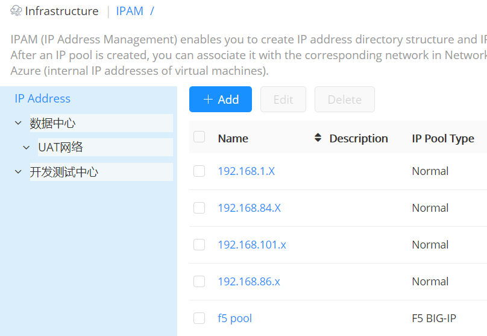
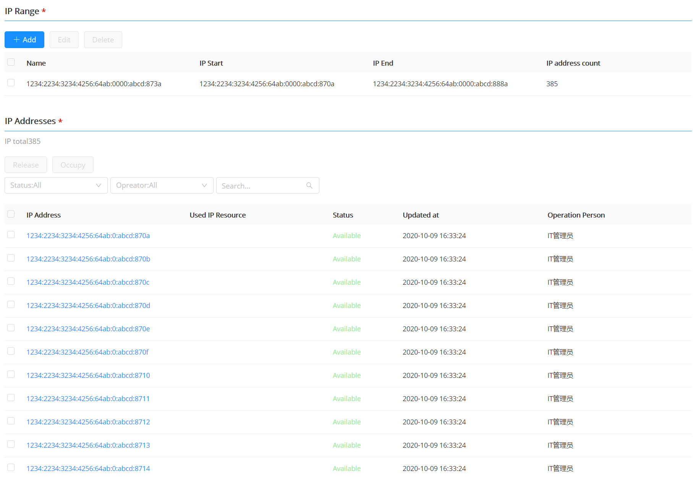
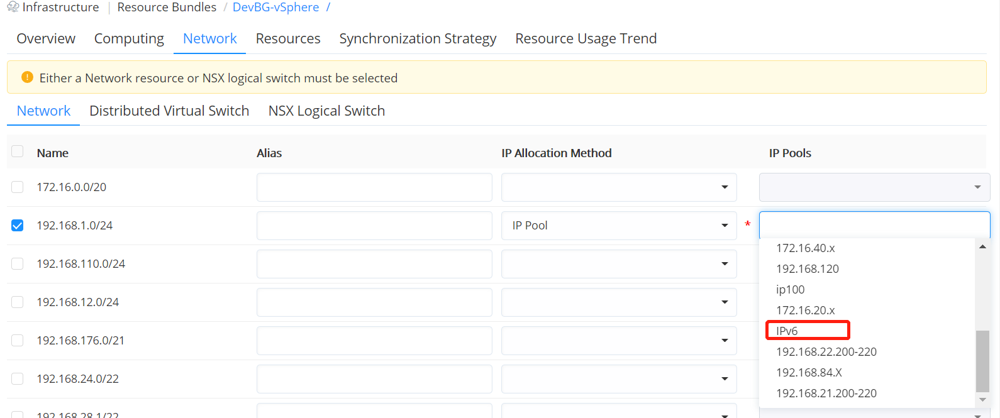
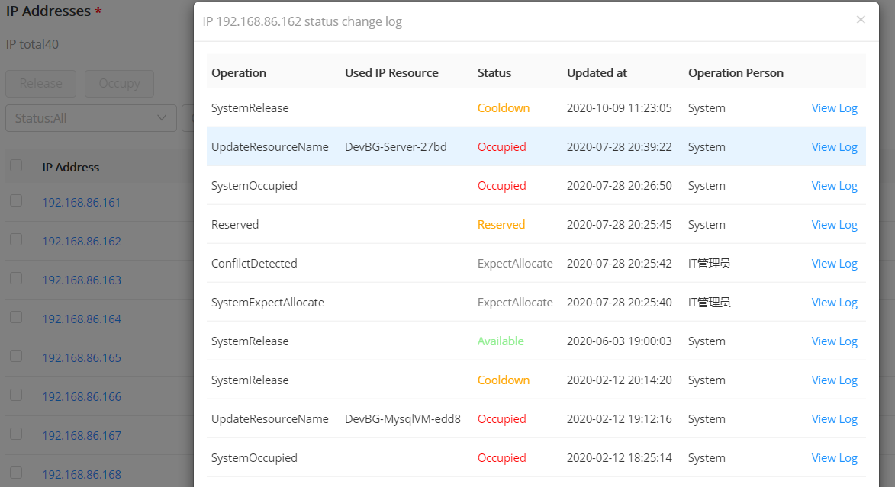

**IPAM**
 
# Functions

You can add IP pools of multiple heterogeneous cloud platforms with one click, configure and manage IP address segments, and display them in a tree structure in the configuration interface. When resources are deployed, the instances of each cloud platform are assigned IP addresses uniformly. Resource deployment brings smooth network services.

+ Support for visually viewing the trend of IP usage and manually releasing.
+ Automatically detect IP address conflicts, set the IP address cooling period, keep the IP for a period of time after release, and then put it back into the IP pool for allocation after the cooling period
+ \It is also possible to query the detailed log information of the IP address usage.
+ Provide full lifecycle management of IPv4 and IPv6, create IP pools, associate with resource bundles, check IP conflicts, automatically assign IPs during resource deployment, etc.
+ The following will introduce how to create and use an IP pool. Currently, the IP pool supports vSphere, OpenStack, Azure, PowerVC, X86, F5 Big IP cloud platform, virtual intranet IP address and Cisco ACI.

# IP Tree Structure

+ IP tree display: A directory structure in IP address management. The directory contains multiple levels, each level of the directory contains the name, description, and network segment.

    + Tenant administrators and IAAS administrators can create, update and delete IP pool directories, and have the authority to create, update, delete, and view IP pool directories.
    + Other tenants can only have the permission to view the IP pool directory.
    + Specific steps to add IP tree: Click "Infrastructure"-"IPAM", click on the Add Folder page, enter the name, description, CIDR, gateway. Click Submit to create an IP tree structure. Click edit to edit the name, description, gateway and other related information, and to delete the IP information.
    + As shown in the figure below, create an IP address directory management suitable for the data center. There are multiple environments such as development and testing, production, and UAT in the data center, which are grouped to manage all IP pools in a unified and standardized manner.

# Create and Manage IP Pool

+ Take the uniform allocation of IPv6 addresses to instances during vSphere virtual machine deployment as an example to illustrate the steps to create, configure, and use IPv6 IP pools.

    + Supports the configuration of IPv6 and IPv4 gateways and routes, and provides flexible option switches to confirm whether the current IP pool supports IPv4, IPv6 or both.
    + Create an IPv6 IP pool. Click "Infrastructure"-"IPAM" to display the list of IP pools, click the Add button, and fill in the name of the IP pool vSphere-VM-IPv6, description, type and select IPv6, IPv6CIDR and gateway. For an IP pool that supports IPv6, as shown in the figure below, each IPv6 IP range cannot exceed 10 bits, which is a maximum of 1024 IPv6 addresses. For IP pools that support IPv6, there is a separate tab page for IPv6 IP ranges.
    
    + The IP pool is associated with the vSphere resource bundke. As shown in the figure below, select the created IPv6 IP pool in the network resource.
    
    + Manage IP addresses: in the IP address list interface, click on the IP pool name to manage the IP address. You can view the trend of IP usage, and manually release it. Support IP address conflict detection, cooling period setting: IP is reserved for a period of time after release, after that, put it back into the IP pool for allocation and support detailed log information query of IP address usage

    + You can refer to the following steps to manage IP addresses: select the "IP Range" tab, you can see the details of all managed IP addresses in the IP pool: IP address, IP resource, status (available, occupied, unavailable, cooling, reserved, pre-allocated), update time and operator. Support the release operation of the occupied and cooling IP addresses, and occupy the available IP addresses.
    + Click "IP address" to display the status update and conflict detection operation log of the IP.
    
    
>「Note」 IP management supports custom setting the duration of the cooling period. After the IP address is released, the IP address will enter the cooling period, and the IP address will be reassigned after the cooling period ends.

This section describes how to create and use IP pools. Currently IP pools support vSphere Cloud Platform, OpenStack, Azure, PowerVC, X86, F5 Big IP Cloud Platform, Virtual Intranet IP Address, and Cisco ACI IP tree display.

Tenant administrators and IAAS administrators can create, update, and delete IP pool directories, and create, update, delete, and view permissions on IP pool directories.

Others in the tenant can only view the IP pool directory and have the right to view the IP pool directory.

Here are the specific steps to add an IP tree:

1.  Click “Infrastructure” - “IPAM”, click  , on the Add Folder page, enter the name, description, CIDR, gateway.

2.  Click Submit to create an IP tree structure.

3.  Click  to edit the name, description, gateway and other related information, and click  to delete the IP information 

# Add an IP Pool

Click "Infrastructure" - "IPAM" to display the IP pool list, showing the IP pool name, description, category, status, creator, used IP address, and creation time.

## IP Pool {#IP Pool}

1.  Click “Add” and select “IP Pool” to enter the Create IP Pool page.

2.  On the Overview tab, fill in the following information:

-   Basic information: name, description (optional), CIDR, gateway

-   DNS/WINS information

3.  On the “IP Range” tab: Create an IP range, click “Add”, enter the name, start IP and end IP, and click “Submit”.

4.  After the addition is successful, in the IP address list, the added IP address and its status will be displayed, such as available and occupied. Manually occupy or release the IP address

5.  Click “Save” and the IP pool is created successfully

## F5 BIG-IP IP Pool {#F5 BIG-IP IP Pool}

1.  For the F5 BIG-IP IP pool, click “Add” and select “IP Pool (F5 BIG-IP)” to enter the Create IP Pool page.

2.  On the “Profile” tab, you need to fill in the following information:

-   Name description

-   IP range: Click “Add”, enter the name, start IP and end IP, click “Submit”

-   After the addition is successful, on the IP address list interface, the added IP address and its status will be displayed, such as available and occupied. Manually occupy or release the IP address

3.  Click “Save” and the IP pool (F5 BIG-IP) is created successfully

## ACI IP Pool {#ACI IP Pool}

1.  For the Cisco ACI IP pool, click Add and select IP Pool (ACI) to enter the Create IP Pool page.

2.  On the “Overview” tab, you need to fill in/select the following information:

-   Basic information: cloud platform portal, Bridge Domain, Subnet, name, description, CIDR (automatically fill, does not support custom editing), gateway

-   DNS/WIN information

3.  On the IP Range tab: Create an IP range, enter a name, start IP and end IP, and click Submit. After the addition is successful, the added IP address and its status will be displayed on the IP address list interface, such as available and occupied. Manually occupy or release the IP address

4.  Click “Save” and the IP pool (Cisco ACI IP) is created successfully.

## IP Pool List

Click "Infrastructure" - "IPAM" to display a list of IP pools. On this page, users can view the basic information of the configured IP pool in the current system.

# Edit/Delete an IP Pool

On the IP address list interface, select an IP pool and click Edit to enter the IP pool editing interface. Click "Delete" to confirm the deletion and click "Yes" to delete the IP pool.

# Manage IP Addresses

On the IP address list interface, click the IP pool name to manage the IP address. The main function points are:

-   View IP usage trends, manually release

-   Support IP address conflict detection

-   Support IP address cooling period setting

-   After the IP is released, it will remain for a period of time. After the cooling period, it will be re-inserted into the IP pool for distribution.

-   Detailed log information of IP address usage query supporting

You can refer to the following steps to manage the IP address:

1.  Select the IP Range tab to see details of all managed IP addresses in the IP pool: IP address, resources using IP, status (available, occupied, unavailable, cooling, reserved, pre-allocated), Update time, operator.

2.  Supports the release of the occupied and cooled IP addresses and the occupation of available IP addresses.

>「Note」IP management supports the IP pool cooling period and supports the custom setting of the cooling period. After the IP address is released, the IP address will enter the cooling period, and the IP address will be reassigned after the cooling period ends.

3.  Click “IP Address” to display the operation log of the status update and conflict detection of the IP.

## Edit/Delete IP Pool

On the IP address list interface, select an IP pool and click "Edit" to enter the IP pool editing interface. Click "Delete" to confirm the deletion and click "Yes" to delete the IP pool.