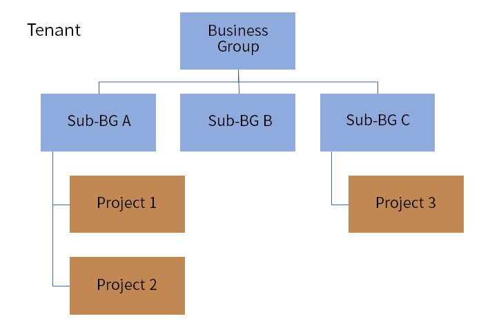

**Organization**

A business group is a logical organization structure within a tenant. SmartCMP supports the creation of a multi-level business group for the organization structure of the enterprise within the system. The business group associates the user to which the business group belongs and the resource bundles that the business group can use. A business group is a logical concept. Entities that need to associate users, service catalogs, and resource quotas can be associated with business groups, such as subsidiaries, departments at different levels, and so on. Default business group and tenant administrator, business group administrator, and business group members are created by default. 

A business group can create one or more projects. The user members in the project can only be derived from the members of the business group where the project is located and can access each other's virtual machines created by the project members.

Tenants provide logical isolation of resources and division of management boundaries, where the logical relationship between tenants, business groups, and projects is as follows:

