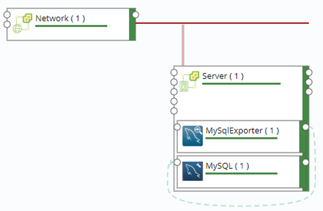
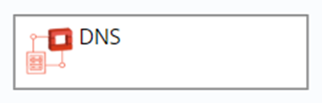
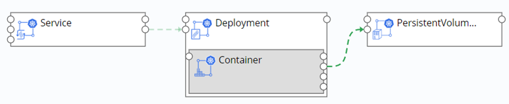
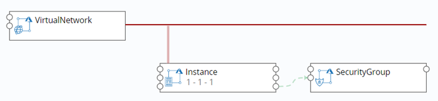
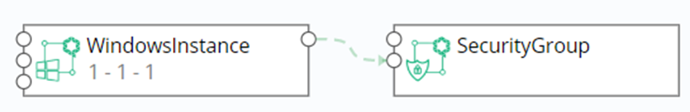

 **Blueprint Design**

Software architects can design application blueprints based on the TOSCA standard through a blueprint management interface. A blueprint is an abstraction of an application. The blueprint contains the topology, workflow, and policy of the application. Blueprint is the core concept of the system, and the whole system is managed around the blueprint.
# Blueprint
You can follow the steps below to see the current tenant's blueprint: 

1.  In the left navigation bar, select Service Design - Blueprints and a blueprint list appears. There are add, copy, publish, unpublish, import, export, and delete operations. The publish and unpublish operations are dynamically available based on the blueprint status. If the blueprint is in the published state, the unpublish operation is available. Same as publishing operation 

2.  Blueprint lists can be sorted by name, status, and creation time. You may search by blueprint name.

## Built-in blueprint

Currently, SmartCMP has built-in typical vSphere, OpenStack, and Kubernetes blueprints for your convenience. You can use these built-in blueprints directly when creating service configurations. In the left navigation bar, select "Service Design" - "Blueprints", a blueprint list appears, and the creator's blueprint for the system is the system built-in blueprint. 

### Visual Editor Overview

Click on the blueprint name or add a new blueprint to enter the visual editor.

The visual editor includes the following sections:

1.  Component List Panel: The component list contains the various components of the cloud infrastructure supported by SmartCMP, as well as your own components. All components that appear in the SmartCMP component view are in the Custom Components panel. You can select any component and drag and drop it onto the canvas.

2.  Canvas: The core part of the visual blueprint, you can drag and drop components onto the canvas, and different components can establish connections on the canvas to define the relationship between components.

3.  Basic information panel: Includes the name, description and icon information of the blueprint which you can change.

4.  Input Panel: Manage all the input in the blueprint

5.  Output panel: Manage all the output in the blueprint

6.  Selected component's component information panel: Contains basic information, parameters, etc. of the selected component

### Add and set components {#Add and set components}

Once the component is dragged and dropped onto the canvas, the component is added to the blueprint, and after the component is selected, the component can be edited in the component information panel. Editing can be done in the following sub views:

-   Basic information: You can see the type of component in the basic information, and you can edit the name of the component.

-   Parameters: a list of parameters for the component, including the parameters of the component itself and the parameters inherited from the parent node, where the parameters can be set

-   Function: A list of the functions of the component, indicating the functions that the component can provide. Once other components require the functions in the function list as a prerequisite, the connection of other components to the component can be established to provide the function to other components.

-   Prerequisites: A list of potential features required by the component. Once the functions in the list are fully or partially satisfied, the component can run the work, where you establish a connection with other components to meet your needs.

-   Connection: A list of all connections to a component. Once the required functionality of a component in the prerequisite is met, the corresponding connection will appear here, where you can edit and delete the connection.

### Removal of components {#Removal of components}

After the component is dragged and dropped onto the canvas, to delete the component, right-click on the component and the component can be deleted from the pop-up context menu.

### Cloud Platform Components and Connection instructions {#Cloud Platform Components and Connection instructions}
|vSphere|Instructions|
|:----:|:----:|
	|Network|	Connect the Server's Network node to the Network component's link node when connecting to the Server.|
	|Disk|	Drag the Disk component to the Server |
	|Lswitch|	NSX Logical Switches reproduce switching functions (unicast, multicast, and broadcast) in a virtual environment that is completely out of the underlying hardware. Connect the Lswitch to the Server/Windows Server node|
	|DLR	|NSX logical (distributed) router Connects DLR to Lswitch |
  |	SecurityGroup|	NSX security group, connect SecurityGroup to Server/WindowsServer node |	
	|LoadBalancer|	VirtualServer is built into the LoadBalancer. Connect the Edge node of the LoadBalancer to the Edge|
	|VirtualServer|	VirtualServer is built into the LoadBalancer. Connect the Server node of the VirtualServer to the Sever.|

|OpenStack|Instructions|
|:----:|:----:|
	|Network|	Connect the Server's Network node to the Network component's link node when connecting to the Server.|
	|Router	|Route, connect the Network node of the Router to the route node of the Network component.|
	|FloatingIP	|Floating IP: Connect to the floatingIP node of the Server component |
	|Volume|	Drag and drop the Volume component into the Server |
	|SecurityGroup|	Security group, the Security_Group node of the Server component is connected to the SecurityGroup |
	|LoadBalancer	|Listener built in the LoadBalancer Connected to the Server through the Listerner|
	|Firewall|	Firewall, deployed separately|
	|Listener|	The load balancing listener is built into the LoadBalancer and connects the Server node of the Listener to the Server. Multiple Listeners can be built into LoadBalancer, and Listener can be connected to multiple Servers.|
  |DNS|	Domain name system, deployed separately|

|PowerVC	|Instructions|
|:----:|:----:|	
|	Network|	Connect the Server's Network node to the Network component's link node when connecting to the Server.|
|	Volume|	Drag and drop the Volume component into the Server|
|Physical Host	|Server	Network	|

|Kubernetes |Instructions|
|:----:|:----:|	
|	Deployment|	Provides a declarative definition method for POD and ReplicaSet for easy management of applications|
|	Nginx- Container|	Container, drag and drop the Nginx-Container component into the Deployment. Connect config_Map to the ConfigMap.|
|	Service|	Service defines an abstraction: a logical grouping of Pods, a policy that can access them - often referred to as a microservice. Connect the deployment node of the component to the deployment component|
|	Ingress|	Provide services with URLs for external access to the cluster, load balancing, SSL termination, HTTP routing, and more. Connect the Service node of the component to the Service component|
|	PersistentVolumeClaim|	Request a storage resource. Connect the container's PVC node to the component|
|	ConfigMap|	A key-value pair for saving configuration data that can be used to save a single property or save a configuration file. Connect the Nginx-Container ConfigMap node to the component|
|	Secret|	Solve the configuration problem of sensitive data such as passwords, tokens, and keys. Connect the Container's Secret node to the component|
|	ServiceEndpoint	|Connect the Service_endpoint node of the Container to the Container node of the ServiceEndpoint, and then connect the software_component node of the ServiceEndpoint to the software component.|
|	DaemonSet|	Ensure that a copy of the container is running on each Node, often used to deploy some cluster logs, monitoring or other system management applications. Built into the DaemonSet|
|	StatefulSet|	In order to solve the problem of the state service, the Container is built into the StatefulSet|

Docker	Container	Docker container, you can fill in the image name in the component parameter, connect the Dependency node of the component to the feature of the container when connected to other components.

|Aliyun| Instructions|
|:----:|:----:|		
|	SecurityGroup|Connect the dependency node of the Instance component to the SecurityGroup|
|	Disk	|Drag the Disk component to the Instance|
|	LoadBalancer|	Connect the dependency node of the Instance component to the LoadBalancer|

Apsara Stack
+ SecurityGroup	Connect the dependency node of the Instance component to the SecurityGroup
+ Disk	Drag the Disk component to the Instance
+	LoadBalancer	Connect the dependency node of the Instance component to the LoadBalancer

Tencent Cloud
+ SecurityGroup	Connect the Security_group node of the Instance component to the Security node of the SecurityGroup component

QingCloud
+ SecurityGroup	Connect the Security_group node of the Instance component to the Security node of the SecurityGroup component
+ 	Volume	Request a storage resource.

Physical Server	Server	Network	
+ Disk	Disk
+	Network	Network

|AWS |Instructions|
|:----:|:----:|	
|	Instance|	Connect the Security_Group node of the Instance component to the SecurityGroup|
|	WindowsInstance	|Connect the Security_Group node of the WindowsInstance component to the SecurityGroup|
|	Volume|	Request a storage resource. No node|
|	RDS|	A database instance is a stand-alone database environment that runs in the cloud. No nodes.|
|	S3Bucket|	Storage component|
|	SecurityGroup|	Connect the Security_Group node of the Instance component to the SecurityGroup|

|Azure|Instructions|
|:----:|:----:|	
	|Instance|	Connect the virtualNetwork node of Instance to the Link node of VirtualNetwork.|
	|WindowsInstance|	Connect the virtualNetwork node of WindowsInstance to the Link node of VirtualNetwork	|
	|LoadBalancer	|The LoadBalancerRule is built into the LoadBalancer and connected to the Instance through the LoadBalancerRule.|
	|LoadBalancerRule|	LoadBalancerRule is built into LoadBalancer, and the instance of LoadBalancerRule is connected to Instance's loadBalancer_rule.|
	|AvailabilitySet|	The availability set, connecting the availability_set node of the Instance to the instance node of the AvailabilitySet|
	|BlobContainer|	Block storage|
	|Disk| Disk|
	|SecurityGroup|Connect the Security_group node of the Instance component to the Security node of the SecurityGroup component|

|F5 BIG-IP|Instructions|
|:----:|:----:|	
| BIG-IP	LoadBalancer|	Load balancing, connecting the Application node of the component to the Server|
|	SNATPool|	Load balancing, connecting the dependency node of the component to the server|
|	Pool|	Load balancing, connecting the pool node of the component to the server|
|	VirtualServer|	Load balancing, connecting the virtualserver node of the component to the server|

ACI	
+ EPG	

SW Component		
+ Custom software in Software Components

Exporter		
+ Custom Exporter in Software Components

Abstract Cloud Component

A universal solution designed by SmartCMP that can access the computing, storage and networking of any cloud platform in a universal or extended manner. Extract the attributes common to each cloud platform, including: Linux/Windows Server,Network/Subnet, Disk.
+ SecurityGroup
+ ObectStorage
+ LoadBalancer
+ Volume
+ Network
+ WindowCompute
+ Compute	

### Establish Connection {#Establish Connection}

1.  In the Component Information panel - Prerequisites, add a connection.

2.  Add in the blueprint. All the components and connections on the canvas form a blueprint. When a component is dragged and dropped into the blueprint, the component's "join point" is created on the left and right borders of the component. The connection point on the left border corresponds to the function list of the component, and the connection point on the right border corresponds to the precondition list of the component. Therefore, you can use the mouse to select the "precondition" connection point on the right border. At this time, the system will give you all the potential connectable "feature" connection points in the blueprint. You can select one of them to connect.

### Edit the connection {#Edit the connection}

Refer to [Software Components](https://cloudchef.github.io/doc-en/AdminDoc/05ServiceDesign/SoftwareComponents.html)

### Delete Connection {#Delete Connection}

Delete in the component information panel: any type of component connection can be deleted here. Select the connection in the "Component Information Panel" - "Connection" and click Delete.

Delete in the blueprint: Select a connection, right-click, and delete the selected connection in the pop-up context menu. Most of the connections can be removed like this.

>「Note」：Connections between virtual machine and network components, virtual machine and storage component are exceptions which cannot be deleted in this way.

## Build Blueprints

### Build vSphere Single-node Blueprints {#Build vSphere Single-node Blueprints}

1.  Choose "Service Design" – "Blueprints" and click "Add"

2.  Enter blueprint name and description and click "OK" to enter visualized editor

3.  Select the Server and Network components under the vSphere column from the list of components on the left and drag them to the canvas area on the right

4.  Define network: Click the network node on the right side of Server and drag it to the link node of Network to establish the network connection between the server and the network 

5.  Click "Verify" in the upper left corner to verify the blueprint, indicating that "It’s a validate blueprint! "

6.  After verification please click "Save" in the upper left corner and then click "Back"  to return to blueprint list interface

7.  Blueprint release: In blueprint list, select the vSphere blueprint you just edited, click "Publish", and then click "Yes"

8.  Success and status turning into Published, means vSphere virtual machine blueprint is published successfully

9.  You may also click "Publish"   after verification to publish blueprint

### Create VMware NSX Blueprint {#Create VMware NSX Blueprint}

1.  Choose "Service Design" – "Blueprints" and click "Add"

2.  Enter blueprint name and description and click "OK" to enter visualized editor

3.  Select the Server, Lswitch, DLR, and SecurityGroup components under the vSphere column from the component list on the left and drag them to the canvas area on the right

4.  Click the lswitch node on the right side of the server and drag it to the Lswitch node (display green) to establish the connection between the server and the Lswitch

5.  Click the lswitch node on the right side of the DLR and drag it to the Lswitch node to establish a connection between the DLR and the Lswitch

6.  Click the Server_WindowsServer node on the right side of the SecurityGroup and drag it to the node of the server to establish the connection between the SecurityGroup and the Server

7.  Click "Verify" in the upper left corner to verify the blueprint, indicating that "It’s a validate blueprint! "

8.  Click “Save and Publish” to publish the blueprint, prompting the blueprint to be published successfully

### Create vSphere MySQL with Monitoring Blueprint {#Create vSphere MySQL with Monitoring Blueprint}

Create application software deployments and blueprints with application monitoring. Take deployment of an instance on vSphere installing MySQL and MySQL monitoring as an example: 

1.  Choose "Service Design" – "Blueprints" and click "Add"

2.  Enter blueprint name and description and click "OK" to enter visualized editor

3.  Select the Server and Network components under the vSphere column from the list of components on the left and drag them to the canvas area on the right.

4.  Define network: Click the network node on the right side of Server and drag it to the link node of Network

5.  Add components: Select MySQL and MySQLExporter components under the Software column, drag to the server node box, select the name of the connection, and click "Finish"

6.  Add dependency: Click the node to the right of MySQLExporter and drag it to the feature node on the left side of MySQL to add the dependency of MySQLExporter and MySQL.

7.  Click "Verify" in the upper left corner to verify the blueprint, indicating that "It’s a validate blueprint! "

8.  Publish: Click "Publish" in the upper left corner to publish blueprint

9.  According to the service configuration steps in Chapter 6.4, select the blueprint just released and publish the service catalog.

10. Service catalog request is deployed after the business group process (approval). After the deployment is successful, you can view the monitoring information of the MySQL component. 

### Create OpenStack Single-node Blueprint {#Create OpenStack Single-node Blueprint}

1.  Choose "Service Design" – "Blueprints" and click "Add"

2.  Enter blueprint name and description and click "OK" to enter visualized editor

3.  Select the Server and Network components under the OpenStack column from the list of components on the left and drag them to the canvas area on the right

4.  Define network: Click the network node on the right side of Server and drag it to the link node of Network to establish the network connection between the server and the network

5.  Click "Verify" in the upper left corner to verify the blueprint, indicating that "It’s a validate blueprint! "

6.  After verification please click "Save" in the upper left corner and then click "Back" to return to blueprint list interface

7.  Blueprint release: In blueprint list, select the OpenStack blueprint you just edited, click "Publish", and then click "Yes"

8.  Success and status turning into Published, means OpenStack virtual machine blueprint is published successfully

9.  You may also click "Publish" after verification to publish blueprint

### Create OpenStack Firewall Blueprint {#Create OpenStack Firewall Blueprint}

1.  Choose "Service Design" – "Blueprints" and click "Add"

2.  Enter blueprint name and description and click "OK" to enter visualized editor

3.  Select the Firewall components under the OpenStack column from the list of components on the left and drag them to the canvas area on the right

4.  Click "Verify" in the upper left corner to verify the blueprint, indicating that "It’s a validate blueprint! "

5.  After verification please click "Save" in the upper left corner and then click "Back" to return to blueprint list interface

6.  Blueprint release: In blueprint list, select the OpenStack Firewall blueprint you just edited, click "Publish", and then click "Yes"

7.  Success and status turning into Published, means OpenStack Firewall virtual machine blueprint is published successfully

8.  You may also click "Publish" after verification to publish blueprint

### Create OpenStack LoadBalancer with SecurityGroup Blueprint {#Create OpenStack LoadBalancer with SecurityGroup Blueprint}

1.  Choose "Service Design" – "Blueprints" and click "Add"

2.  Enter blueprint name and description and click "OK" to enter visualized editor

3.  Select Server and Network under the Openstack column from the list of components on the left and drag them to the canvas area on the right. Click the network node on the right side of the server and drag it to the link node of the Network to establish the connection between the Server node and the Network.

4.  From the left component list, under the Openstack column, select the LoadBalancer component to the right canvas area, then drag the Listener under the Openstack column to the LoadBalancer node box, and click Finish to create a load balance listener (Listener) and load balancer ( LoadBalancer) built-in relationship

5.  Click the server node on the right side of the Listener and drag it to the server node of the Server to establish the association between the Listener and the Server node

6.  From the Openstack column of the left component list, drag the SecurityGroup component to the canvas area on the right, click the security_group node on the right side of the Server component to the security node on the left side of the SecurityGroup, and establish the connection relationship between the Server and the SecurityGroup.

7.  Click "Verify" in the upper left corner to verify the blueprint, indicating that "It’s a validate blueprint! "

8.  After verification please click "Save" in the upper left corner and then click "Back" to return to blueprint list interface

9.  Blueprint release: In blueprint list, select the OpenStack LoadBalancer with SecurityGroup blueprint you just edited, click "Publish", and then click "Yes"

10. Success and status turning into Published, means OpenStack LoadBalancer with SecurityGroup virtual machine blueprint is published successfully

11. You may also click "Publish" after verification to publish blueprint

### Create OpenStack FloatingIP Blueprint {#Create OpenStack FloatingIP Blueprint}

1.  Choose "Service Design" – "Blueprints" and click "Add"

2.  Enter blueprint name and description and click "OK" to enter visualized editor

3.  Select the FloatingIP components under the OpenStack column from the list of components on the left and drag them to the canvas area on the right

4.  Click "Verify" in the upper left corner to verify the blueprint, indicating that "It’s a validate blueprint! "

5.  After verification please click "Save" in the upper left corner and then click "Back" to return to blueprint list interface

6.  Blueprint release: In blueprint list, select the OpenStack FloatingIP blueprint you just edited, click "Publish", and then click "Yes"

7.  Success and status turning into Published, means OpenStack FloatingIP virtual machine blueprint is published successfully

8.  You may also click "Publish" after verification to publish blueprint

### Create OpenStack DNS Blueprint {#Create OpenStack DNS Blueprint}

1.  Choose "Service Design" – "Blueprints" and click "Add"

2.  Enter blueprint name and description and click "OK" to enter visualized editor

3.  Select the DNS components under the OpenStack column from the list of components on the left and drag them to the canvas area on the right

4.  Click "Verify" in the upper left corner to verify the blueprint, indicating that "It’s a validate blueprint! "

5.  After verification please click "Save" in the upper left corner and then click "Back" to return to blueprint list interface

6.  Blueprint release: In blueprint list, select the OpenStack DNS blueprint you just edited, click "Publish", and then click "Yes"

7.  Success and status turning into Published, means OpenStack DNS virtual machine blueprint is published successfully

8.  You may also click "Publish" after verification to publish blueprint

### Create Kubernetes Blueprint {#Create Kubernetes Blueprint}

1.  Choose "Service Design" – "Blueprints" and click "Add"

2.  Enter blueprint name and description and click "OK" to enter visualized editor

3.  Select the Service and Deployment components under the Kubernetes column from the list of components on the left and drag them to the canvas area on the right.

4.  Drag the Deployment node on the Service component to the Deployment component to establish the dependency between the Service and the Deployment.

5.  Add the Container component: Select the Container component under the Kubernetes column from the list of components on the left, drag it into the Deployment node box, select the name of the connection, and click “Finish” to establish the dependency between Container and Deployment.

6.  Add the PersistentVolumeClaim component: Select the PersistentVolumeClaim component in the Kubernetes column from the list of components on the left and drag it to the canvas area on the right. Drag the PVC node of the Container component to PersistentVolumeClaim to establish the dependency between Container and PersistentVolumeClaim

7.  Click "Verify" in the upper left corner to verify the blueprint, indicating that "It’s a validate blueprint! "

8.  After verification please click "Save" in the upper left corner and then click "Back" to return to blueprint list interface

9.  Blueprint release: In blueprint list, select the Kubernetes blueprint you just edited, click "Publish", and then click "Yes"

10. Success and status turning into Published, means Kubernetes virtual machine blueprint is published successfully

11. You may also click "Publish" after verification to publish blueprint

### Create Aliyun Blueprint {#Create Aliyun Blueprint}

1.  Choose "Service Design" – "Blueprints" and click "Add"

2.  Enter blueprint name and description and click "OK" to enter visualized editor

3.  Select the Instance and SecurityGroup components under the Aliyun column from the list of components on the left and drag them to the canvas area on the right

4.  Drag the Dependency node on the Instance component to the feature node of the SecurityGroup component to establish the dependency between the Instance and the SecurityGroup

>「Note」If you need to create a new security group during service configuration, under the SecurityGroup parameter, remove the checkmark "Use existing resources".

5.  Click "Verify" in the upper left corner to verify the blueprint, indicating that "It’s a validate blueprint! "

6.  After verification please click "Save" in the upper left corner and then click "Back" to return to blueprint list interface

7.  Blueprint release: In blueprint list, select the Aliyun blueprint you just edited, click "Publish", and then click "Yes"

8.  Success and status turning into Published, means Aliyun virtual machine blueprint is published successfully

9.  You may also click "Publish" after verification to publish blueprint

### Create Azure Blueprint {#Create Azure Blueprint}

1.  Choose "Service Design" – "Blueprints" and click "Add"

2.  Enter blueprint name and description and click "OK" to enter visualized editor

3.  From the list of components on the left, select the VirtualNetwork and Instance components under the Azure column and drag them to the canvas area on the right. Drag the virtualNetwork node on the Instance component to the link node of the VirtualNetwork component to establish the dependency between Instance and VirtualNetwork.

4.  Select the AvailabilitySet, SecurityGroup, and BlobContainer components in the Azure column and drag them to the canvas area on the right. Drag the availability_set node on the Instance component to the instance node of the AvailabilitySet component and drag the security_group node on the Instance component to the security node of the SecurityGroup component, establishing Instance and Availability, SecurityGroup dependencies

5.  Select the LoadBalancer component under the Azure column and drag it to the canvas area on the right. Then drag the LoadBalancerRule to the LoadBalancer node and click Finish to create a load balancing rule (LoadBalancerRule) and a load balancer (LoadBalancer) built in relationship

6.  Drag the instance node on the LoadBalancerRule component to the loadbalancer_rule node of the Instance component to establish the dependency between Instance and LoadBalancerRule.

7.  Click "Verify" in the upper left corner to verify the blueprint, indicating that "It’s a validate blueprint! "

8.  After verification please click "Save" in the upper left corner and then click "Back" to return to blueprint list interface

9.  Blueprint release: In blueprint list, select the Azure blueprint you just edited, click "Publish", and then click "Yes"

10. Success and status turning into Published, means Azure virtual machine blueprint is published successfully

11. You may also click "Publish" after verification to publish blueprint

### Create AWS Blueprint {#Create AWS Blueprint}

1.  Choose "Service Design" – "Blueprints" and click "Add"

2.  Enter blueprint name and description and click "OK" to enter visualized editor

3.  Select the Instance and SecurityGroup components under the AWS column from the list of components on the left and drag them to the canvas area on the right. Drag the security_group node on the Instance component to the security_group node of the SecurityGroup component to establish the dependency between the Instance and the SecurityGroup

4.  Click "Verify" in the upper left corner to verify the blueprint, indicating that "It’s a validate blueprint! "

5.  After verification please click "Save" in the upper left corner and then click "Back" to return to blueprint list interface

6.  Blueprint release: In blueprint list, select the AWS blueprint you just edited, click "Publish", and then click "Yes"

7.  Success and status turning into Published, means AWS virtual machine blueprint is published successfully

8.  You may also click "Publish" after verification to publish blueprint

### Create QingCloud Blueprint {#Create QingCloud Blueprint}

1.  Choose "Service Design" – "Blueprints" and click "Add"

2.  Enter blueprint name and description and click "OK" to enter visualized editor

3.  Select the WindowsInstance and SecurityGroup components under the QingCloud column from the list of components on the left and drag them to the canvas area on the right. Drag the security_group node on the WindowsInstance component to the security node of the SecurityGroup component to establish the dependency between WindowsInstance and SecurityGroup

4.  Click "Verify" in the upper left corner to verify the blueprint, indicating that "It’s a validate blueprint! "

5.  After verification please click "Save" in the upper left corner and then click "Back" to return to blueprint list interface

6.  Blueprint release: In blueprint list, select the QingCloud blueprint you just edited, click "Publish", and then click "Yes"

7.  Success and status turning into Published, means QingCloud virtual machine blueprint is published successfully

8.  You may also click "Publish" after verification to publish blueprint

### Create Hyper-V Blueprint {#Create Hyper-V Blueprint}

1.  Choose "Service Design" – "Blueprints" and click "Add"

2.  Enter blueprint name and description and click "OK" to enter visualized editor

3.  Select the WindowsInstance and NetworkAdapter components under the Hyper-V column from the list of components on the left and drag them to the canvas area on the right

4.  Define the network: Click the network node on the right side of the WindowsInstance, drag it to the link node of the NetworkAdapter, and establish the network connection between WindowsInstance and NetworkAdapter

5.  Click "Verify" in the upper left corner to verify the blueprint, indicating that "It’s a validate blueprint! "

6.  After verification please click "Save" in the upper left corner and then click "Back" to return to blueprint list interface

7.  Blueprint release: In blueprint list, select the Hyper-V blueprint you just edited, click "Publish", and then click "Yes"

8.  Success and status turning into Published, means Hyper-V virtual machine blueprint is published successfully

9.  You may also click "Publish" after verification to publish blueprint

### Create a Blueprint for F5 and OpenStack Combinations {#Create a Blueprint for F5 and OpenStack Combinations}

When the platform supports the deployment of virtual machines and application software, the network configurations such as Virtual Server, Pool, and SNAT Pool connecting F5 are deployed at the same time automatically. The following content takes combining OpenStack components and F5 components as an example. 

You can create a blueprint for combining OpenStack virtual machines, OpenStack applications, and F5 components by following these steps:

1.  Choose "Service Design" – "Blueprints" and click "Add"

2.  Enter blueprint name and description and click "OK" to enter visualized editor

3.  Select the Server and Network components under the OpenStack column from the list of components on the left and drag them to the canvas area on the right

4.  Define the network: Click the network node on the right side of the server and drag it to the link node of the network to establish the network connection between Server and Network

5.  Then select the Pool, VirtualServer, and SNATPool components under the F5 column from the list of components on the left, and drag them to the canvas area on the right

6.  Click the application node on the right side of the Pool to connect to the server node on the left side of the server. Click the pool node on the right side of the VirtualServer to connect to the virtualserver node on the left side of the Pool. Click the snatpool on the right side of the VirtualServer to connect to the virtualserver node on the left side of the SNATPool

7.  Click "Verify" in the upper left corner to verify the blueprint, indicating that "It’s a validate blueprint! "

8.  After verification please click "Save" in the upper left corner and then click "Back" to return to blueprint list interface

9.  Blueprint release: In blueprint list, select the F5 and OpenStack blueprint you just edited, click "Publish", and then click "Yes"

10. Success and status turning into Published, means F5 and OpenStack virtual machine blueprint is published successfully

## 	Modify the Blueprint

You can modify the blueprint by following the steps below: 

1.  In the left navigation, select "Service Design" - "Blueprints"

2.  Click on the blueprint name to enter the blueprint editing interface, modify the blueprint as needed, and click “Save”

## Copy Blueprints

You can delete the blueprint by following the steps below: 

1.  In the left navigation, select "Service Design" - "Blueprints"

2.  After selecting a blueprint in the blueprint list, the “Copy” button in the menu bar will become available. Click “Copy” to change the blueprint name and click “Submit”. The blueprint is copied successfully.

## Import Blueprints

You can import blueprints by following the steps below: 

1.  In the left navigation, select "Service Design" - "Blueprints"

2.  Click the "Import" button

3.  Fill in the blueprint name, blueprint description (optional), click "Browse", select the local blueprint, click "Submit"

4.  Blueprint import successfully

5.  When the blueprint is successfully imported, the components in the blueprint are updated synchronously. If the component type is already in the CMP, the component is directly updated. The component version is increased by 1. You can view the component version details in Software Components - History Version. If the component type does not exist, create the corresponding component directly.

## Export Blueprints

You can export the blueprint by following the steps below: 

1.  In the left navigation, select "Service Design" - "Blueprints"

2.  After selecting a blueprint in the blueprint list, the Export button in the menu bar will become available. Click Export.

The blueprint of the Zip format is successfully exported.

## Delete blueprint

You can delete the blueprint by following the steps below: 

1.  In the left navigation, select "Service Design" - "Blueprints"

2.  Select the blueprint and click the “Delete” button to confirm that the blueprint is deleted successfully.

# Publish Blueprint

You can publish the service by following the steps below: 

1.  In the left navigation, select "Service Design" - "Blueprints"

2.  Select the “Unpublished” blueprint in the list, click the operation button and select “Publish”. After confirming the release, the blueprint is successfully published, and the blueprint status in the list is “Published”.

## Cancel Blueprint Release

You can cancel the blueprint that has been released by following the steps below:

1.  In the left navigation, select "Service Design" - "Blueprints"

2.  Select the “Published” blueprint in the list, click the operation button and select “Unpublish”. The blueprint is unpublished successfully. The blueprint status in the list is “Unpublished”.
