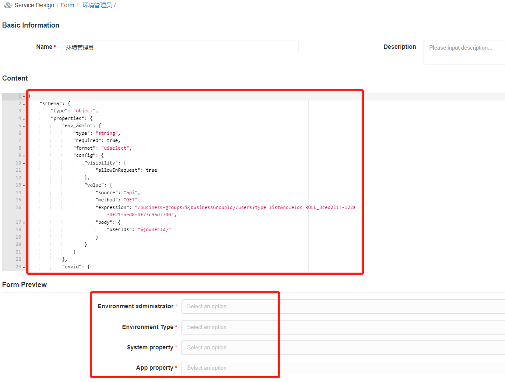

**Form**

When creating or configuring a service, you can select a form built into the system (IP pool creation form, project creation form allowing users to automate the creation of IP pools, projects, etc.). If you need to modify or add additional field information for users to apply for Fill in, you can customize the configuration form through the form designer. 

For example: apply for a new project, apply for an email account, apply for a resource pool, add an environment administrator. 

System built-in form:
+ IP pool Creation, which defines the information that users need to enter when they request to create a new IP pool.
+ Project Creation, which defines the information that users need to enter when they request to create a new project.
+ Attachments Uploading, use this when uploading the required materials for approval. The file size cannot exceed 500KB.
+ Resource pool expansion, which defines the information that users need to enter when requesting resource pool expansion.

The following describes the specific steps for adding a new form. After the field of the form configuration is completed, you can customize it when you apply for the service in the service catalog.

### Add a form

In the navigation on the left, choose Service Design - Form, click Add in the form configuration list interface, enter the basic information of the form (form name and form description); enter the JSON configuration of the schema at the content of the form, which is required on the UI. Support for JSON syntax highlighting. You may view custom form content at the form preview.

+	Source and responsibilities of the environment administrator: The environment administrator specifies from the testers; the testers are associated with the Test Business Group. The environment administrator only has the right to view and operate associating virtual machines (that is, when the environment administrator is configured for the vSphere service, the environment administrator will be associated with the virtual machine deployed by the service). 

+	Through the setting of the environment administrator, the service deployment can be extended to better control the service deployment and operation of virtual machines. 

+	Binding service with environment administrator form during service configuration. 

+	When applying for the service, specify the environment administrator, select the environment type (configured in advance in conjunction with the business needs of the enterprise), system attributes, and application attributes.

>「Note」 Supports flexible expansion, allowing you to configure more field information that meets your needs based on business needs.

### Edit/Delete forms

In the left navigation, select "Service Design" - "Form ", click Edit in the form configuration list interface to modify the basic information of the form (form name and form description), modify the JSON configuration of the schema at the content of the form or view the custom form content at the preview.

In the navigation on the left, choose Service Design – Form, click Delete on the form configuration list interface to delete the form.
