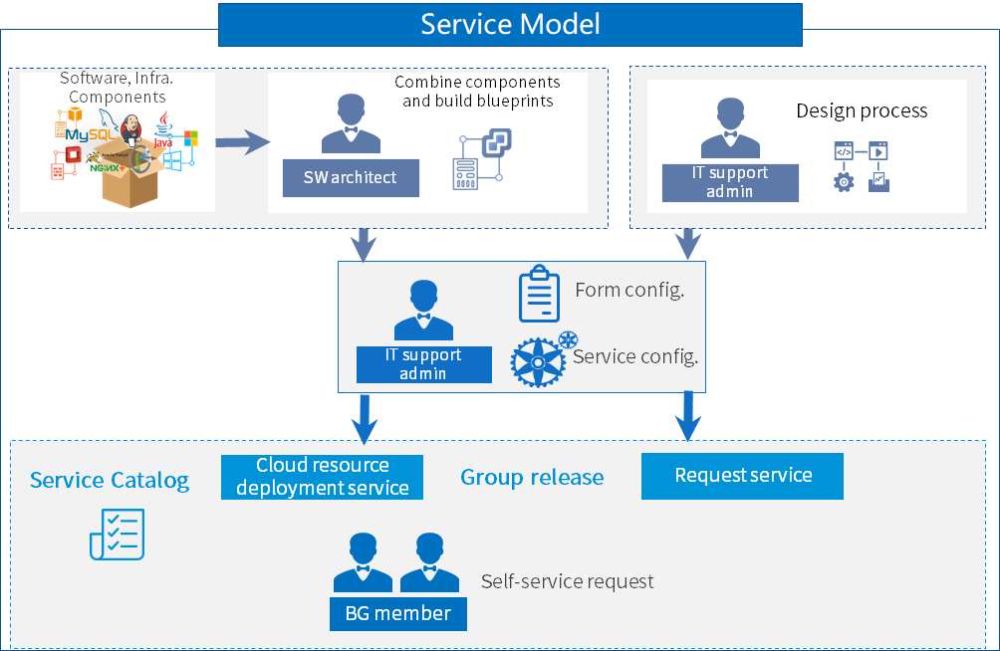

**6	Service Design**

In SmartCMP, all services are based on blueprint modeling to define standard service frameworks and components. SmartCMP provides a rich set of out-of-the-box software components that visualize blueprints, provide custom forms, and define parameters and fields for any service. Flexible configuration of resources for each service meets the diverse needs of users. At the same time SmartCMP provides a built-in process designer, allowing users to design service processes and approval processes in a visually drag-and-drop manner, helping users to complete process strategy design accurately and quickly.
The administrator groups the services through the service catalog to publish the IT products and services required by the enterprise or organization and provides the users with self-service requests. Service modeling configures resources, parameters, automated workflows, and approval policies for each service for automated deployment. 

The following diagram describes the whole process of how to assemble components, build blueprints, configure service, group service, and publish. Software architects combine software components and infrastructure components to build a blueprint for cloud services. Administrators configure resources and parameters for services. IT support administrators define processes and specify service teams to group and publish services to service catalogs. The business group members apply for self-service in the service catalog according to actual needs.
>Note:For the specific operation of the service application, please refer to: [Cloud Service Management](http://CMP-PUBLIC-IP/help/AdminDoc/06云服务管理/)

