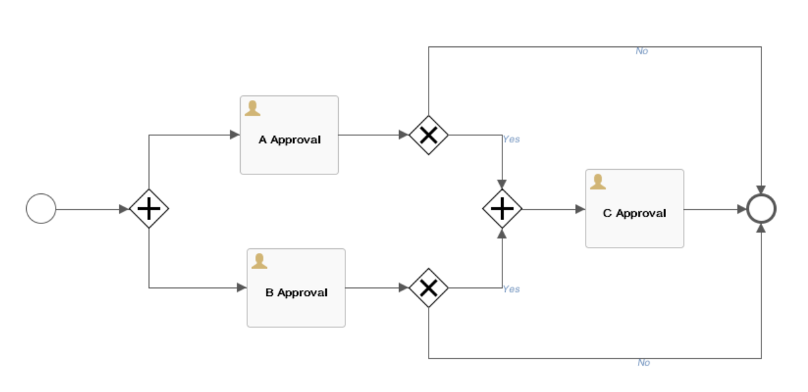
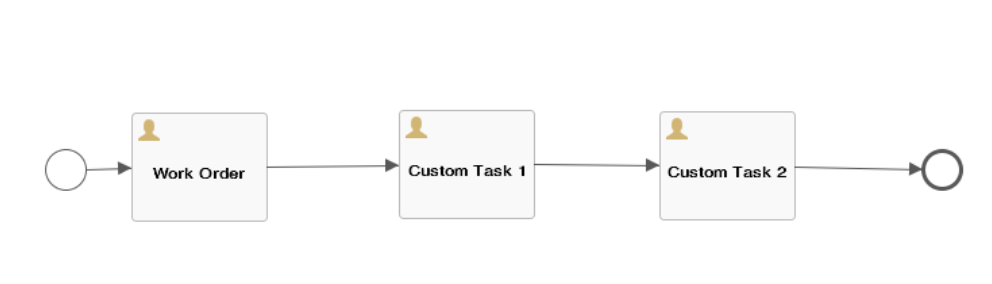

 **Workflow application scenario**

In the process of self-service request, approval, automated deployment, operations, and manual ticket of cloud resources, the workflow defines the methods and strategies of these task processing or service configuration processes.

The system provides standard workflows by default and supports administrators to define the processes required for flexible services through the workflow designer, control cloud application, operations, and recycle, and manage and close manual ticket services.

There are three main types of workflows for the platform: approval, manual ticket service, and cloud resource blueprint service process.

# Approval Workflow Management

Support tenant administrators to customize the approval workflow template through the workflow designer. The specific configuration of the customization includes the approval hierarchy, the approval of the approver, the approval rules, and the operations that can be performed.

Main function point:

-   Support for defining any multi-level approvals.

-   Support the entire workflow of graphical design approval in Workflow Designer.

-   Support for defining approval by user or role.

-   Support for defining the configuration of the request when defining an approval.

-   Support for defining requirements for approval and notification at the business group and service catalog level.

-   Support for approver batch operation approval.

-   Support for setting fields that can be modified by each level of approver.

## Configure Workflow

There are two ways to configure the SmartCMP configuration workflow:

1.  First, the business group administrator or tenant administrator adds the approval workflow A to the business group configuration.

2.  Second, the business group administrator or tenant administrator adds the approval workflow B to the service configuration.

3.  When the two configuration methods are used at the same time, the approval workflow conflicts. The approval workflow B in the service configuration takes precedence over the approval workflow A in the business group configuration.

### Add a Workflow to a Business Group

You can add an approval workflow to a business group. After the configuration is successful, when a business group member applies for service deployment, it needs to be controlled through the workflow in the approval template.

1.  "Organization" - "Business Group", click the business group name to enter the business group details page

2.  On the Approval Workflow tab, select the approval template and click Save

3.  After saving, the members of the business group will enter the approval workflow when applying for services

### Add a Workflow in Service Configuration

After the service catalog is successfully applied, if the service is configured with the approval workflow in advance, the service will enter the approval queue and obtain the approval comments of the relevant members in the approval template. Deployment can be performed only after the approval is passed.

Example: Select a service such as "vSphere single-node service" and add an approval workflow for the service in the service configuration

1.  Service Design - Catalog Config, select vSphere Single Node Service in the Service Configuration List. 

2.  Click the service name to enter the Edit Service page. On the Approval Configuration page, select the approval workflow (the service configuration workflow. The content of the approval workflow can only be viewed and selected and cannot be edited or deleted.) Click Save. After saving, the application for the service needs to be approved according to the approval workflow of the template before deployment.

3.  Service applicant clicks on the service catalog in the left navigation bar, selects “vSphere Single Node Service”, and clicks to enter the service application page.

4.  Fill in the application form: including the business group (when the card is shared to all business groups), the service deployment name (if the business group does not set the service deployment naming rules), the number of deployment, project, owner, deployment reason, virtual Machine template, etc., click "Apply" after filling out.

5.  Check the status of the application: enter the "Request" - "Pending Approval", the application status is in "pending approval" status.

6.  Approval: The approver specified in the approval template logs into the system and enters the " Requests" - "Pending Approval" to select the project to be approved.

7.  Enter the approval comments, click “Approve”, a confirmation prompt will pop up, click “Yes”

8.  View the approved projects: Enter "Requests" - "Approved Request", the status of the project is "Approval"

9.  After the applicant logs in to the system, go to "My Requests" and the blueprint deployment status of the application changes to "Approved".

10. In Service Deployment, the project has begun deployment. After the deployment is successful, in Service Deployment, select the service to allow the service to be operated. 

## Custom Parallel Approval Workflow {#Custom Parallel Approval Workflow .afff6}

1.  In the left navigation bar, click "Service Design" - "Workflow", click on the Add Name (Parallel Approval Workflow), Description, Category (Approval Workflow) and other information, then use the Workflow Designer to design and define the approvals workflow you need to enable.

2.  Select the parallel approval workflow and go to the Workflow Designer to customize the specific strategy graphically:

 Introduce the use of the workflow designer: the left circle represents the starting node, the right circle represents the ending node, and the parallel approval workflow sets two parallel approval links (approval A link, approval B link). If a request passes through the A link and passes The B link, it is successful. If any of the two links fails, the request fails. As the picture shows:

### Approvers can choose roles

1. Approvers can choose roles. For example, a tenant administrator, a business group administrator, etc., can also designate a user as an approver.

    Built-in role usage in the approval workflow:In order to satisfy the approval workflow, we need to add an additional approval role to the approval workflow if we want approval to start with the applicant's lowest-level organizational structure and then the business group where the resource is located.
     
    When the administrator edits the approval workflow, the approver selects "role" and lists the built-in approval roles:

    "Primary Business Group Administrator": defined as the administrator of the lowest-level business group where the user is located

    "Secondary business group administrator": defined as the administrator of the upper-level business group where the user is located.

    A two-level approval workflow is added to the approval workflow. The first-level role selects the “first-level business group administrator” and the second-level role selects the “second-level business group administrator”. Approval can be initiated from the lowest organizational structure of the business group where the applicant resources are located.

2. The approver selects the dynamic user, specifies the “dynamic user” ${FORM.approver}, customizes the form for the service, and binds the approver field at the form configuration, so that you can specify any user as the approver's needs.

3. Approvers’ choices are based on access rights and when this workflow is used for deployment or cloud resource operational approval, only users with read access to the resource can receive approval requests.

4. Approval changes (allow or do not allow the approver to modify) Advanced configuration (configurable specific fields that the approver can modify, such as CPU, memory, etc.)

5. There are two types of approval rules:The first type is a fixed value, that is, if the number of approvers meets the set number, then the approval passes, and if one person refuses to pass, the approval fails. The second type is the percentage of approve members meets the set percentage. If one person rejects, the approval fails.

The specific operations are divided into approval operations and execution operations:

The approval operation is the authority given to the level approver to approve, reject or return the application.
There is no approval permission for execution operations. It cannot reject or return but only check the application content and confirm the approval as the reviewer.
In addition, you can also define whether the layer approver has the right to modify the application. If necessary, please check “allow modification to the application”.

## Built-in approval workflow {#Built-in approval workflow .afff6}

The system has built-in tenant administrator approval workflow, business group administrator approval workflow, and approval template workflow, which is convenient for users to directly select the required approval workflow.

The built-in approval workflow cannot be modified or deleted. It only supports viewing and use. The user-defined add-on approval workflow supports modification and deletion.

-   Tenant Administrator Approval: Defined as an administrator within the tenant system where the user is located

-   Business Group Administrator Approval: Defined as the administrator of the business group in which the user is located

-   Approval Template Workflow: Built-in Cloud Service Deployment Approval Workflow

# Ticket Service Workflow Management

The manual ticket service workflow defines the specific processing steps, service teams, service personnel, and transfer methods of the ticket tasks.

After the service group is established, the ticket is created through the service configuration, and the ticket is published to the service catalog to complete the release of the service card and the management of the service catalog. The following sections will detail the steps to configure the manual ticket service process, configure the manual ticket service, and publish the manual ticket service.

## Custom Add Manual Ticket Service Process

In the left navigation bar, click "Service Design" - "Workflow", click Add, enter the name (manual ticket service process), description, select category (manual ticket service), upload process configuration file.

## Built-in manual Ticket service process

The manual ticket service process built into the platform includes standard manual tickets, standard event management processes, and automated service processes.

+ Standard event management process to solve problems related to IT resources, such as: unexpected server shutdown, network interruption, etc., network IP address conflicts, and so on. The process type belongs to the manual ticket service.
+ Standard manual tickets: Services that require IT manual intervention, such as manual ticket services that require a password reset.
+ Automated service process: The user applies for the manual ticket service. After the service is approved, the user can automatically create the resources requested, for example, create a project, create an IP pool, and so on.

>「Note」The manual ticket service process built in does not support modification and deletion. It only supports viewing and use. The manual ticket service process added by the user supports modification and deletion.

# Incident

The standard event workflow Incident Report is used to solve problems related to IT resources, such as server down, network IP address conflicts, and so on. The workflow type belongs to the manual ticket service.

The specific process is as follows:

1.  The main aspects of the standard event workflow include: first-line processing support, second-line processing support, and shutdown services.

The first- and second-line task processing links can be assigned to different teams. After the first-line processing supports receiving the event, the operations that can be performed are as follows:

-   Direct processing, after the problem is solved, fill in the cause or the description of the problem or the solution

-   Transfer to other business groups

-   Upgrade: Upgrade to the second line for processing and fill in the upgrade instructions

After the second-line support process receives the event, the operations that can be performed are as follows:

-   Direct processing, after the problem is solved, you can fill in the reason for the problem and the explanation of the solution

-   Transfer to other teams

2.  The email notifies the user that the problem has been solved. After the user who initiated the manual ticket service application receives the problem-solving email, the user performs the service shutdown operation, and the ticket status changes to “processed”; if the user chooses to re-process the ticket , then return to the handler of the previous level. (When the email informs the user in the previous step, whoever processed it is returned to whom, the second-line processing returns to the second line, and the first line returns to the first line), and the ticket status changes to "Processing".

# Cloud Resource Blueprint Service Workflow{#Built-in standard cloud service deployment workflow .afff6}

Built-in standard cloud service deployment workflow: Define the workflow of cloud resource automation deployment, which belongs to the cloud resource blueprint service workflow built into the system.

To meet the service process requirements of different service items, the platform has built-in multiple service processes and custom added service processes. System administrators and tenant administrators can access the Configuration Management - Workflow page to add, view, workflow design, enable, disable, edit, and delete workflow templates. The following describes the specific steps.

>「Note」: Built-in service workflow does not support editing, workflow design, enable, disable, delete operations

1.  Click "Service Design" - "Workflow" in the left navigation bar, click the "Add" button.

2.  Enter the new workflow page and enter the basic information of the custom process: workflow name, description, category (cloud resource blueprint service, manual ticket service and approval process). After saving the name, category and other information, you can use the workflow designer to design and define the processes you need to enable.

 Introduce the method of creating the basic flow chart: the left circle represents the starting node, the right circle represents the ending node, and the ticket task processing flow can be customized after the task 1, the custom task 2, or the rest of the custom task. as the picture shows:

3.  Click the Save button to create a custom service workflow.

# Standard Task Execution
Built-in incident execution process: Define the process of automated task execution. Specific task types include: service provision tasks, cloud resource tasks, Jenkins tasks, script tasks, wait tasks, etc. Through service configuration, the specific type of service is configured, and the standard task execution process is bound. After the configuration is completed, it will be published to the service catalog, and a task can be executed directly by applying for a service.

## Edit and Delete Service Workflows

In the left navigation bar, click "Service Design" - "Workflow" to select a workflow, click "Edit" - "Workflow Design" to directly enter the UI of the Service Workflow Designer, display the process of the workflow, and visually change the design workflow.

>「Note」The workflow selected must be a custom added workflow, and the system built-in workflow does not support workflow design.

In the left navigation bar, click "Service Design" - "Workflow", select a service workflow, click the "Delete" button, and the delete prompt box will pop up. Click "Yes" to prompt the deletion of the service workflow.

>「Note」Deletion fails when the workflow definition is being used in a service configuration.

## Enable and Disable Service Workflows

In the left navigation bar, click "Service Design" – “Workflow”, select a service workflow, click the "Enable" button to enable the service workflow.

In the left navigation bar, click "Service Design" – “Workflow”, select a service workflow, and click the "Disable" button to disable the service workflow.

>「Note」There are two main workflows for the system: standard cloud service deployment and standard manual tickets. These two built-in workflows are enabled by default and cannot be disabled, modified, or deleted.
