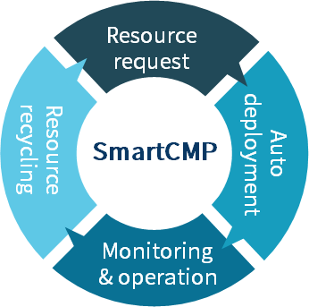

**Cloud Service Mgmt.**

The full lifecycle management of cloud resources is summarized as five steps of cloud resource blueprint service application, service deployment, self-service operation, monitoring alarm and resource recovery. The following sections will introduce you to the details of cloud resource lifecycle management.

