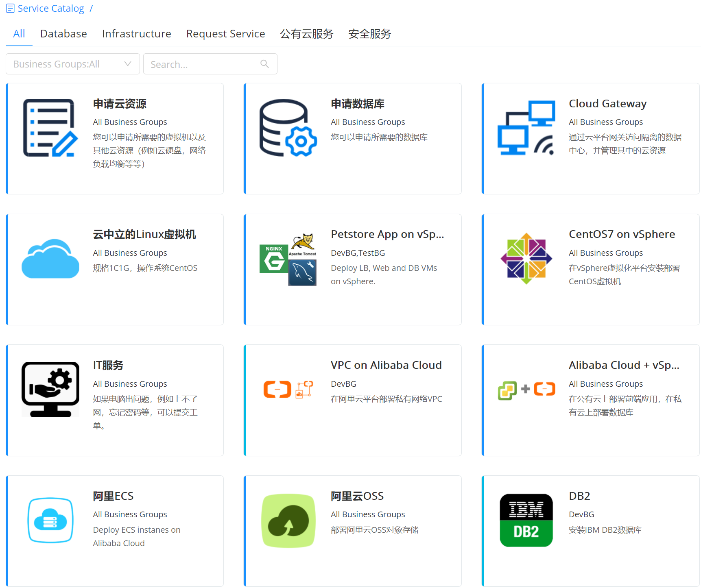

**Service Catalog**

# Functions

The main function of the service catalog is to provide users with a unified cloud service portal. The request, operation, change, monitoring and recycling of cloud resources are all service-oriented, and enterprise-level processes, permissions and quota control are provided.
+ Provides the ability to request any cloud service on one page, so that users can easily access various types of Alibaba Cloud services, VMware cloud resource services, container cloud services, ticket services, mail service and so on in the form of a service catalog. For example: Tomcat, MySQL cluster, J2EE three-tier application, etc. The example is as follows:

+ Among them, ticket services are non-standardized services that require manual intervention and support, including service requests, event handling when cloud resources have problems, such as users who forget their passwords and need to reset them, or submit a request to open an email or account .
+ The service catalog are all configured through the blueprint of the cloud management platform and then the corresponding parameter configuration. Services can be deployed in private clouds or public clouds. They can also be applied to more and more hybrid cloud deployments. For example, front-end applications are deployed on Alibaba Cloud and databases are deployed on private clouds.
+ In the service catalog, you can also define service groups and place these services into categories to facilitate service management and search.
+ Moreover, the service catalog can be diverse, and the services that different users can access can be set to create a user-oriented, personalized, and unified service portal with multiple cloud service types.

+ When requesting a service, whether Alibaba Cloud services or VMware resources, the cloud platform provides a unified public cloud service experience, lowering the threshold for users to use, and displaying different configurations of each service according to resource usage and price The overall service cost. As shown below:

# Service Catalog Display
After the service configuration is published successfully, you will see the published service card in the service catalog interface. The interface display of the service catalog supports two methods:
1.	Tab page display: Group display according to the tab page, you can quickly locate the service you need to apply for through the service group label, business group or search box. 
2.	Hierarchical display: According to the card mode, first display the grouping (icon, name, description) in folder display mode, click on a grouping, and then display all the cards in this grouping. For cards without grouping, if you display according to the hierarchy, an ungrouped service folder will be added, click to enter all ungrouped cards. If the cards are grouped, this folder is not displayed. 

>「Note」 Service directory display method, select in the system configuration-interface configuration function area, the specific operation steps, please refer to:[Interface configuration](http://CMP-PUBLIC-IP/help/AdminDoc/09系统管理/#界面配置)

# Tab page display{#Tab page display}

When the service catalog is displayed as a tab page, you can use service grouping tags, such as: database, infrastructure, ticket services, etc., or through different business groups, or use the search box to quickly locate the service you need to apply for. 

Take "Deploy a virtual machine on vSphere cloud platform" as an example:

1. Click "Service Catalog" on the left navigation bar, select a "vSphere VM" service, and click to enter the service application page 
2. Related parameters on the service request page:

 
Organization Information

 +	Business group If the service is all business groups, that is, shared services, you need to select a business group (the business group must have related resource bundles, otherwise applications will not be allowed); if the service has already been assigned a business group during service configuration, you do not need to fill this. 
 +	Project If the project is divided under this business group, you can select the project
 +	Owner Select the owner of the service. The owner must be a member of the business group, the owner of the service deployment. Support updating owner in service deployment. 

Deployment information
 +	Name If the service group has been configured with the “Service Deployment Name Naming Rule”, the service deployment name does not need to be filled in and will be automatically generated according to the business group rules. If the business group is not configured with the “Service Deployment Name Naming Rule”, it must be manually filled 
 +	Quantity Enter the number of deployments. The default is 1.
 +	Execution time You can specify the time to start service deployment, accurate to the minute 
 +	Key-value labels Checked by default, all server nodes use the same key-value labels. If not checked, all server nodes under the service deployment will be listed, and key-value labels can be set separately for each server node 

Other information
 +	Parameters of the form configuration If you customize the relevant fields for the cloud resource blueprint service and the manual order service in the form configuration of the service configuration, fill in the required information here 
Request parameters
 +	Request parameters If when configuring the service only the “Allow change” option is checked, the application parameter column will appear, and related server, network, and other components can be configured as required. 
 +	Software configuration If you select “Add software when applying” during service configuration, a software configuration bar will appear. You can add software for the computing node / software component of the service. Click “Add Software” to select the software to be installed. All software components will be listed. Select the relationship: "install to" or "depends on"; select the nodes to install or depend on.

 Click "Apply" after completing the filling. It will be directly deployed or wait for approval according to the business group workflow. You can check the deployment status in "Deployments"-"My Deployments" (also see the deployment status in the "Operation History" in the upper right corner), Or check the approval process in "Service Request"-"Pending Approval". 

 If when you apply for the service, you can’t fill in the relevant parameters all at once, click “Save” to save the filled parameters. In the next application, click “Load” to reload and automatically fill in the last filled in parameters.

 When you apply for a service, configure the charging rules in advance (private and public clouds are different, see below), the platform can display the cost of this application, and the specific configuration steps of the charging rules:
 +	For the private cloud, after the administrator configures the private cloud's charging rules in "Billing & Usage"-"Billing Rules", when users apply for services, they directly use the billing API to billing charging.
 +	For the public cloud, you need to cache the unit price API structure of the public cloud, and then calculate the cost. 

# Hierarchy display
+ Hierarchy display method, according to the card model, first display the service grouping. For specific, please refer to: [Service Grouping](https://cloudchef.github.io/doc-en/AdminDoc/05ServiceDesign/ServiceGrouping.html) 

+ In the service catalog view interface, you can view the icon, name, description, and folder display mode of the service group. Click a group to display all the cards of the service group. (Note: When the service card created by the administrator does not have a service group, if it is displayed in a hierarchy, this type of card will be stored in the "Ungrouped Services" folder. Click to enter all ungrouped cards. If the administrator created service cards are grouped, so the "Ungrouped Services" folder is not displayed.) 

# Select Blueprint for Cloud Resource Request 
SmartCMP supports one service card to bind multiple blueprints and supports users to quickly select blueprints according to their needs. For example, the service card of "Request Database" is configured with Mysql, Oracl, NoSQL and other database-related blueprints in advance. 

For example: You can choose a blueprint self-service application by following these steps: 

1. Enter the "Service Catalog", click "Apply" on the "Apply for Cloud Resources" card, specify a blueprint to associate, and click "Next" 

2. "Basic Information" page, fill in:

 + Business group The business group to which the deployment belongs 
 + Service deployment name Deployment name (if the service group has set a service deployment naming rule, the service deployment name will be automatically generated in accordance with the rules, there is no need to fill in) 
 + Project Deployment project 
 + Owner Deployment owner

 
3. Fill in the relevant application parameters, such as: resource bundle, private network, virtual machine configuration, storage size, number of nodes, and so on.
4. Click "Save", click "Submit" after confirming that there are no errors, and wait for the deployment to complete. 
