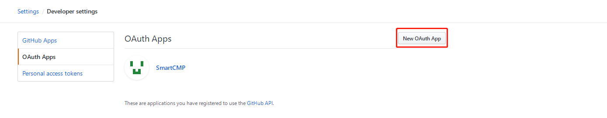
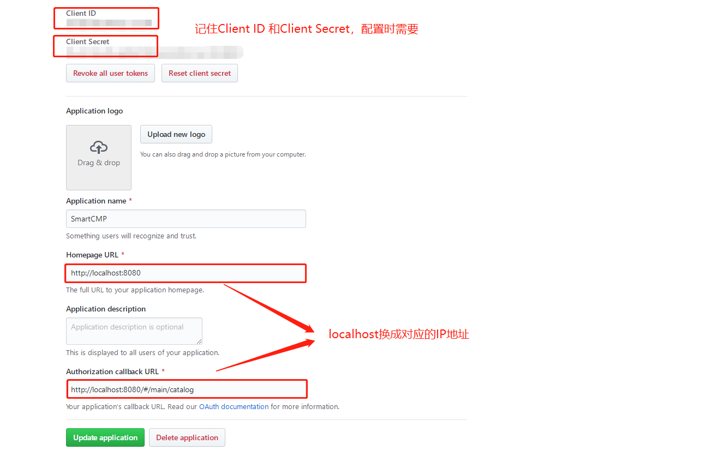
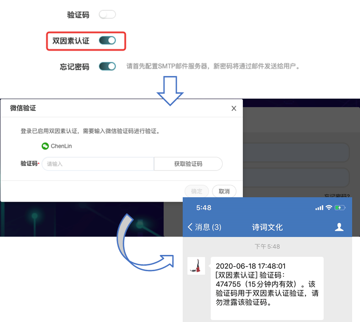
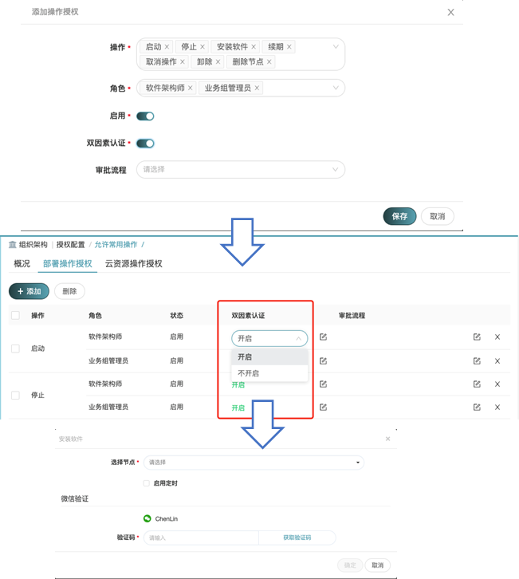

**Settings**
 

# System
In the left menu bar, select "Settings" - "System" to enter the "Overview" page:

Login Type
1. Local Log in
2. LDAP/Microsoft Active Directory: If selected, the “LDAP Configuration” tab will appear.
3. OAuth2
>「Note」Multiple login methods can be configured.
+ DNS domain (OpenStack)	   Add a DNS domain, you can add one or more (optional)
+ A domain name consists of a multi-level domain name such as root domain name, top-level domain, second-level, third-level, etc. Each domain name consists of letters, numbers, and hyphens (-) (the first character cannot be a hyphen) and is not case-sensitive and no more than 63 characters. A full domain name has a total length of no more than 255 characters and must end with a dot. After the configuration is successful, you can configure secondary and tertiary domain names in the OpenStack resource bundle.
>「Note」DNS domain name needs to be configured on the DNS server. If not, it will report an error when applying for service.

# System
Select "Settings"-"System" in the left menu bar:

## User Login Type
A variety of login methods can be configured, including: local login: directly use the user name and password configured by SmartCMP to log in.

### LDAP/Microsoft Active Directory

+ Regardless of the size and nature of the enterprise, a centralized account management system is required. Employees only need to set an account and password once to easily use different systems. (For example: administrative level OA system, mail system, conference room reservation system, etc.. The R&D team may have code management, project progress management, bug tracking, dependency management, Wiki, etc.)

+ When choosing the classic LDAP (Lightweight Directory Access Protocol) as the account management server, LDAP is an open, neutral, and industry standard application protocol that provides access control and maintains distributed information through the IP protocol. Connect OA system, code server, Jenkins and other systems to LDAP to realize sharing a set of accounts among all systems.

+ "LDAP Configuration": LDAP Connection Name, LDAP URL (LDAP server address), Base DN, ROOT DN, Password

+ After the configuration is complete, in the LDAP login UI, enter the LDAP uid/password to log in. After the authentication is successful, you can enter SmartCMP, but the user does not have any permissions after the first login. After the administrator configures ROLE and BG for this user, the user needs to log in again, and then perform other operations normally.

### OAuth2

OAuth2 is an open authorization standard that allows users to let third-party applications to access specific private resources of the user in a service, but does not provide account and password information to third-party applications. For example: user Xiaoming wants to log in to SmartCMP through his github account.
The following introduces you the specific steps of how to log in using OAuth2 for SmartCMP.

+ Select the login type as OAuth2 for specific parameter configuration, take github as an example to obtain authorization information:
+ Log in to giuhub, click on your profile picture, click Settings --> Developer Settings --> OAuth once, click New OAuth App

After successful creation:

+ After the configuration is complete, enter in the browser: http://<server domain name or address> port number/login/oauth2/tenantid, it will automatically jump to the user authorization page, enter the gitHub username and password. And after verification is passed, jump directly to the SmartCMP platform to realize the functional requirements of logging in to SmartCMP through the github account.

### CAS_SSO

+ When the login method is selected as CAS_SSO, the UI interface does not have any configuration information, and the background will be configured in advance. Please consult the delivery engineer for the specific configuration method.
+ User access method: Each tenant of SmartCMP needs to use the login method customized by each tenant when connecting to Cas, for example: tenant "default", then the login address of Cas is custlogin/cas/default, enter the following in the browser: Http://192.168.12.34/custlogin/cas/default. tTe suffix "default" is the id of the current tenant. In practice, replace default with the actual id, and ip (192.168.12.34) is subject to the actual ip

## Business Group

The administrator can configure the default naming policy and entitlement profile for all business groups on the current page, and can check whether to add users to the parent business group at the same time when adding users to the child business group.

The default configuration can be empty. If the default template is configured, each business group no longer needs to be configured separately.

## DNS Config
If you need to configure and publish the DNS service, you can set the DNS root domain name here, and set the subdomain name in the resource bundle according to the needs of different environments, so as to choose in the service configuration.

+ DNS domain (OpenStack) Add one or more DNS domains (optional)
+ The domain name is composed of root domain, top-level domain, second-level, third-level and other multi-level domain names. Each level of domain name is composed of letters, numbers and hyphens (-) (the first character cannot be a hyphen), and is not case sensitive. The length should not exceed 63 characters. The total length of a complete domain name should not exceed 255 characters and must end with a dot. After the configuration is successful, you can configure the second-level and third-level domain names in the OpenStack resource bundle.

>「Note」DNS domain name needs to be configured on the DNS server, if not, an error will be reported when requesting the service.

## Security{#Security}

### Two-factor Authentication Overview

The platform supports enabling two-factor authentication for user login and operations. After two-factor authentication is enabled, an authentication step to verify dynamic information will be added to the original static password verification.

Two-factor authentication is an additional layer of security authentication in addition to the user name and password to ensure the security of the user's identity when logging in and using cloud resources. The platform supports two-factor authentication by sending dynamic authentication information via SMS, email, WeChat and DingTalk.

### Enable Two-factor Authentication

To enable two-factor authentication, please follow the steps below:

1. Connect the system that needs to send authentication information in "Settings"-"Notifications". For the specific configuration method, please refer to: [Notifications](#Notifications)

2. Select the two-factor authentication method on the security configuration tab of "System Management"-"System Configuration", which supports SMS verification, email verification, WeChat verification and Dingding verification.

3. If you need to enable two-factor authentication for user login, please configure in UI. For the specific configuration method, please refer to: [UI](#UI)

4. If you need to enable two-factor authentication for user operations, please set in the entitlement profiles to enable two-factor authentication for deployment operation or cloud resource operation. For specific configuration methods, please refer to: [Entitlement Profiles](http://CMP-PUBLIC-IP/help/AdminDoc/04Organization/EntitlementProfiles.html)

### Usage Scenarios

+ When log-in is enabled with two-factor authentication, on the login interface, the user enters a static password and clicks to log in. A pop-up box will pop up to prompt "Two-factor authentication has been enabled, and verification code needs to be entered for verification". The user can obtain the dynamic verification code through the configured authentication method to complete the two-factor authentication, as shown in the figure below.

+ When two-factor authentication is enabled for operations, taking the installation of software as an example, the user needs to click to obtain the verification code according to the prompts, and complete the two-factor authentication through the configured authentication method.

## Cost

The administrator can set the currency unit of service billing on the current page, which supports the selection of RMB, Euro, US dollar, Japanese yen, British pound, etc. You can check whether to display the estimated cost during service request and deployment.

# UI

Use "System"-"Interface Configuration" to determine brand and service request information including color, 页眉页脚、菜单配色、浏览器标签、登录页面、自注册功能、主页、 about pages, and whether to display help documentation, and adjust the display of service catalogs. 

## Configure Branding

The specific steps to configure the branding: On the branding tab,

+ Choose a bright or dark color style to control the color style of the left navigation bar area.
   The theme color can be selected from solid color or gradient color. Use the color palette to select the set color. When a gradient color is selected, the highlighted menu and buttons will be displayed in a gradient color, and links and labels will be displayed in the second color.
   The text box and button style can be set to square or rounded corners.

+ You can choose whether to hide the header. When you choose not to hide, use the color palette to select the header color, text and icon color (respectively effective), upload icon and custom text content.

+ Configure colors for the menu. You can use the color palette to configure colors for menus, text, and icons, and the color settings will take effect separately.

+ You can choose whether to hide the footer. When you choose not to hide, use the color palette to select the footer color and text color (respectively effective), upload icons, and customize text content.

+ New tenant's menu, header and footer colors will not be affected by other tenants.

+ Upload browser icon and customize browser title.

+ Upload the background image of the login page, define the text on the left side of the login page, customize the text style and color, and the text supports the use of Markdown syntax format.
   Choose whether to use verification code on the login page, and set whether to enable or disable "Forgot password".

+ Choose whether to hide the user self-registration function. When choosing not to hide, click the drop-down box to select the configured form and service to define the fields and self-registration process that the user needs to fill in during self-registration.

+ Upload the homepage icon and configure the jump link of the homepage button which supports external links or relative paths within the system.

+ You can choose whether to hide the about page. When you choose not to hide, upload pictures, define the product name and copyright notice.

+ Define whether to display the help document. When you choose to hide, the question mark button in the upper right corner of the navigation bar will be hidden.

##  Configuration Catalog

Specific steps for configuring service requests: The service catalog currently supports 2 views. On the Service Request tab, 

 +	Tenant administrators can configure how groups and services are displayed in the service catalog: tab display or hierarchy display 
 
    Specific display method: 
    Tab display: group display according to the tab page. 
    Hierarchical display method, according to the card mode, first display the service group
    In the service catalog interface, you can view the service group icon, name, description and folder display mode. Click on a group to show all the cards of this service group.

 + The tenant administrator can configure the field display on the service request page. The configurable fields are: description, execution time, key-value label, business group, project, and owner.

# Notifications

## SMTP configuration

Go to the menu "Settings" - "Notifications". On the SMTP Configuration tab, you can configure the SMTP configuration that the current tenant can access.

The following information can be filled in the SMTP configuration:

Basic Information     |Description
:------------:|: ------------:
Use SSL     | Use SSL for current SMTP
SMTP server  | SMTP server address
Port        | SMTP port number
Username      | Username
Password        | Password
Sender      | Default sender 

After the configuration is complete, you can click "Verify Settings", the system will automatically send a test email to the current account's email address according to the configuration to verify whether the SMTP server is working.

## SMS Configuration

Go to the menu "Settings" - "Notifications". In the "SMS Configuration" tab, you can fill in the SMS (short message) configuration that the current tenant can access.

  Basic Information     |Description
  :---:|:---:
  Username      | Username
  Password        | Password
  SMS server |  SMS server address
  Port     |   SMS port

## Enterprise WeChat

Enter the menu "Settings"-"System", in the "WeChat Enterprise" tab, the tenant administrator can configure the relevant information of the current tenant's WeChat Enterprise, and specify applications for the WeChat Enterprise message notification and approval. The notification application is used to send system notifications to the user's WeChat Enterprise account, and the approval application is used to receive the approval initiated by the system in WeChat Enterprise (the approval process can be configured in the process configuration).

In the menu "Settings" - "Notifications", in the "Enterprise WeChat Configuration" tab, the tenant administrator can configure the information about the current tenant enterprise WeChat.

 Basic Information     |Description
 :---:|:--: 
 Enterprise ID | View in the enterprise WeChat management background "My Business" → "Enterprise Information"
 AgentId | The unique Agent ID of each application, please view it in the enterprise WeChat management background "Applications and applets" → "Applications"
 Secret | Each application has a separate access key. Please view it under the “Applications and Applets”→“Applications” in the enterprise WeChat management background.
 Token  | Credentials for calling the interface, which must be obtained using the secret of the approval or the enterprise's self-built application
 EncodingAESKey | Please view under "Apps and Mini Programs" -> "Apps" in the enterprise WeChat management background

## DingTalk

Enter the menu "Settings"-"System", in the "DingTalk" tab, the tenant administrator can configure the relevant information of the current tenant's DingTalk, and specify the application for DingTalk's message notification and approval (open in DingTalk Third-party enterprise applications created by the platform). The notification application is used to send system notifications to the user's DingTalk account, and the approval application is used to DingTalk to receive the approval initiated by the system (you can configure the approval process in the process configuration).

Go to the menu "Settings" - "Notifications". In the "DingTalk Configuration" tab, the tenant administrator can configure the information about the current tenant’s DingTalk.

 Basic Information     |Description
 :---:|:---:
 CorpId | The identification of the company in DingTalk. Each company has a unique CorpId, which can be viewed under "Homepage" on the DingTalk developer background.
 AgentId |When the application is created, the system automatically generates an Agent Id, which can be used to send enterprise session messages and others.
 AppKey |When the application is created, it is automatically generated by the system together with the AppSecret.
 AppSecret  |When the application is created, the system automatically assigns it, which is the unique identifier in the application development process.
 Token  | An important credential when the enterprise backend obtains information, which is generated by Appkey and AppSecret. Need to be obtained through API Exporer.
 AES_Key | Need to be obtained through API Exporer.
 URL | Need to be obtained through API Exporer.

# Menu{#Menu}

When you access a third-party system or an extended system (such as access to Baidu, JD, Azure bills, dashboards), the menu configuration makes the access menu more flexible.

In the menu configuration you can define a variety of dashboards, you can also access the external system, and freely choose the extended menu, the following describes the specific operation method.

## Add a Menu Configuration

In the menu configuration, users can define the access of the built-in menu, a variety of dashboards and third-party systems. The built-in menus, dashboards and extended systems will be assigned to different roles for viewing according to the defined permissions, and can be displayed flexibly.

Click "System"-"Menu", click Add, select the menu configuration type:

+   Select the access right of the built-in menu to set the role to view the menu. In the drop-down box, select the menu to be configured (Service Request, My Deployment, Report and Analysis, etc.) and the role (tenant administrator, project member, etc.) that can access this menu. Set the status of this menu configuration: enable or disable this configuration.

+   Select Metabase to access the dashboard, and select external URL to access the third-party system.
    Enter the name, description, location, URL parameters, role (select the role that can access this menu), status (choose to enable or disable this configuration) and upload the icon.

You have the flexibility to choose where to extend the menu, for example: 

Add extension menu Baidu, location selection

-  Before system management (system management is a first-level menu), Baidu is also a first-level menu in front of the system management menu.

-  Located in system management (system management is a first-level menu), Baidu is a secondary menu built into the system management menu.

-  After system management (system management is a first-level menu), Baidu is also a first-level menu behind the system management menu.

Click Submit. The menu configuration list displays all the currently added dashboards, displaying the dashboard name, description, ULR source, URL parameters, role (you can view the role of the dashboard), status, creation time, and so on.

## Edit and Delete Menu Configuration

Click "Settings" - "Menu", click Edit, and edit the extended menu information in the "Edit Menu Configuration" tab.

Click "Settings" - "Menu", click delete to delete the extended menu. 

# Report

The report configuration function provides users with more various types of reports to form an extensible report module, which supports administrators to define report functions freely and flexibly.

+ Supports custom report viewing permissions for different roles, sets the status of the report (enabled, disabled), and chooses to assign reports to a role for viewing, such as tenant members, business group administrators, software architects, and custom roles.

+ After the configuration is completed, you can view the corresponding report in Resource Analysis - Report.

