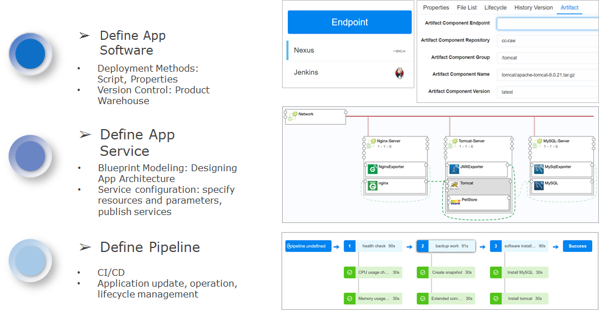
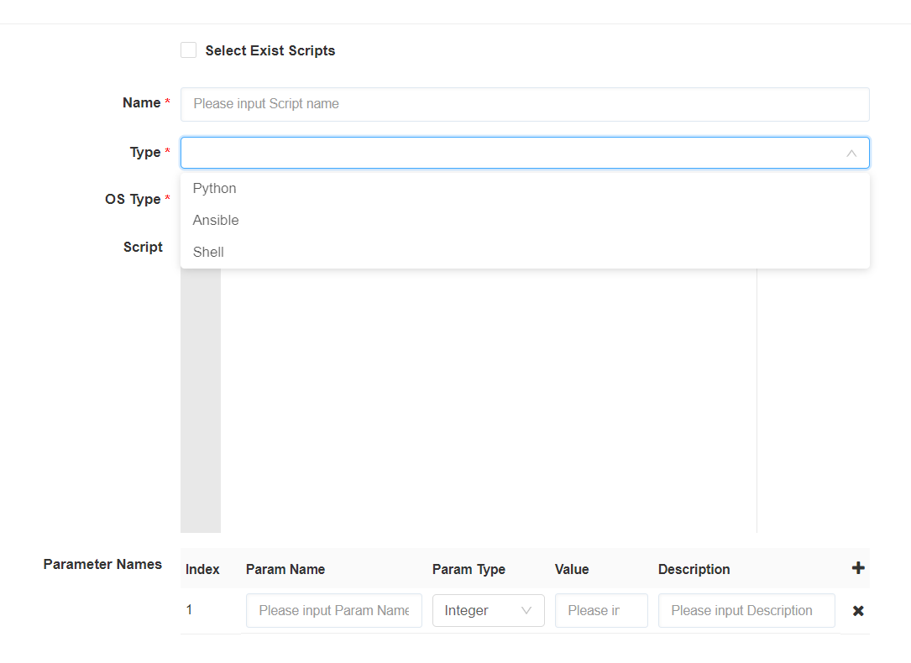
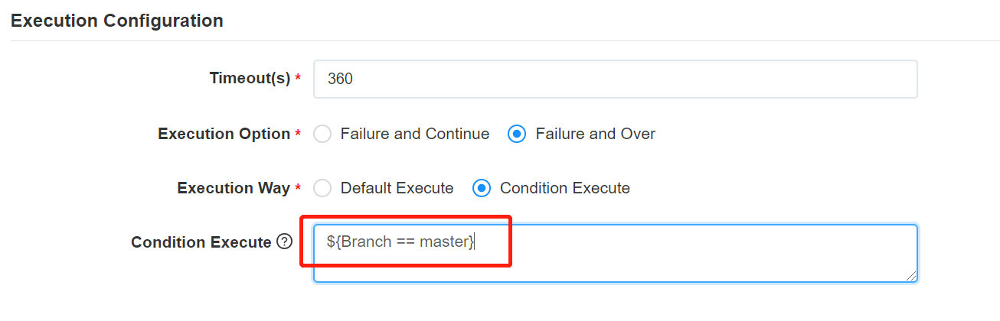

**CI/CD**

SmartCMP’s continuous release and continuous deployment application is achieved through software components, blueprints, and newly introduced pipelines:
+ Define application software: access to the mainstream product library for storage management and version control of software components. Software components associate with product warehouse and custom application deployment methods and related parameters.
+ Define application services: Model the application architecture through blueprint modeling; specify resource parameters and versions of related applications through service configuration.
+ Define the pipeline: configure the pipeline stage and various types of tasks to achieve full lifecycle management of application testing, deployment, update, operation and recycling.

The following describes the specific configuration steps for you.

# Artifact Management
SmartCMP configures application software and manages software components by accessing the mainstream artifact warehouse. The software components are associated with the artifact warehouse and customize the deployment mode and related parameters of the application. Artifact library management is the management of the artifacts generated during the software development process, and the artifacts are generally released and delivered as final deliverables. All artifact packages and dependent components can be integrated into the artifact library for unified management.

+ The artifact warehouse is accessed through the portal in the SmartCMP platform. For specific operation steps, please refer to the endpoint configuration.

+ SmartCMP supports the definition of application software through software component functions, associating artifact warehouse with software components. Artifact warehouse associate storage and manage version control of software components.

The software components are associated with the mainstream artifact warehouse. The specific steps are as follows:

1. Click on the software name in the software component list. The component view contains the "Basic Information", "Properties", "File List", "Lifecycle", "Historical Version", "Artifacts".
2. In the Artifacts view, you can select Endpoints, Repositories (Nexus), Groups, Names, Versions.
3. Click the Save button to associate the component with the package management platform.

+ •	Define application services, based on blueprint modeling, design application architectures, and automate the deployment of each application topology blueprint. Based on the service configuration, configure the node detailed parameters of the software component, allowing the platform to perform application management and automated deployment according to the policy. (The blueprint design is the original function of the platform, and the specific configuration steps are not written here)

Configure the detailed parameters of the node of the software component. The specific steps are as follows:

1. On the left navigation, select "Service Design" - "Catalog Config", the service list appears, the service name is displayed in the list, click the service name, enter the detailed configuration view, click "Components", select the software component 
2. In Node Detail Settings view, configure the group, name, and version of the software component node

## Endpoint{#Endpoint}
Users can add software product repositories that need to be connected through Endpoint, providing the source of the artifacts at deployment time for the software components to be used and defining the docking of software packages or task schedules. The package that performs archiving or image pushing operations in the pipeline will be stored at warehouse and support the Nexus and other artifact warehouse management platforms at the Endpoint. 

Specific steps:
1. Click "CI/CD" - "Endpoint" in the left navigation bar.
+ Click Add Nexus Endpoint and enter the name, address, username, password.
+ Click Add Jekins Endpoint, enter the name, address, type select password to enter the username, password; enter the username and token when selecting the token.

2. Click Verify, Verified Successfully, and click Submit to access the Software Product Warehouse.

# Pipeline{#Pipeline}

SmartCMP's pipeline helps users build automated, reusable, and securely compliant applications for continuous delivery and deployment. The pipeline consists of a series of stages, each consisting of multiple tasks and environments that the software must complete before it is released to production. Currently, it supports the customization and assembly of multiple phases and tasks and can add any number of execution tasks in the stage. Through them, it is possible to design development, deployment, and operation pipelines applicable to various scenarios.

+ Add a pipeline, bind a project, and add global parameters to make calls in later tasks.

Specific steps:

1. Click "CI/CD" - "Pipeline" in the left navigation bar, click Create, enter the name, description, project, notification to the user on the basic information page.
2. Set the custom properties, click the Add button, enter the name, value, description, click Create
3. After you have created the pipeline, click "CI/CD" - "Pipeline" in the left navigation bar to edit, delete, execute, disable or lock the pipeline.

## Configuring Triggers

Customize the trigger condition of the pipeline. The trigger defines when the pipeline is automatically run. You can manually trigger the pipeline task, or you can set the policy to trigger the pipeline task automatically by the trigger. SmartCMP trigger types include: Webhook integration (support Git, Gitlab and other code repository change triggers), Jenkins triggers, timing triggers, manual triggers, and more. 

For example: add a configuration Gitlab event trigger, when the code is submitted to the Gitlab code repository, the repository status changes, triggering the pipeline.

Specific steps:

1. Click "CI/CD" - "Pipeline" in the left navigation bar, click Create, click Create on the trigger page.
2. Enter the trigger name (Gitlab code commit), type (WEBHOOK), description (optional).
3. Click Create to complete trigger configuration.

## Configure Phases and Tasks{#Configure Phases and Tasks} 

+ Phase refers to defining different phases according to the needs of the business and defining the tasks to be completed in each phase. A task is an activity that is performed specifically. Supports custom task types and input and output parameters. The input and output parameters refer to the parameter transfer between each task in the SmartCMP pipeline. For example, the SmartCMP address of a newly deployed virtual machine in the previous task is passed to the next task for invocation.

+ For example, you can define different stages of software packaging, deploying test environments, and more. The task types for each phase include Jenkins Job tasks, service provision tasks, cloud resource tasks, script tasks, and more. The publisher of the pipeline can define the parameters for each task and make calls in subsequent tasks.

+ For example, deploying tasks through a blueprint can automatically trigger a published cloud resource service to deploy cloud resources. Cloud resource tasks can automate cloud resource changes and operations and upgrade and update application software.	

Specific steps in the design of the flow phase and tasks:

1. Click "CI/CD" - "Pipeline" in the left navigation bar, click Create, click the Add button on the process page, enter the stage name, click Add
2. Click Add Serial Task to fill in the task details page: task type, name, description, notification to the user, fill in the input parameters, customize the output parameters (the input and output parameters change accordingly to different task type)
    + Select the wait task and fill in the wait time (s) at the input parameters. For example: after waiting for 15s, the pipeline automatically executes the script.
    + Select the service provision task and fill in the services (services published in the service catalog) and templates at the input parameters;

    >「Note」 The selectable service type is from the published service card in the service catalog, and the selectable template is from the template that saves the request information when the service is applied. Specific steps: click on the left navigation bar "Service Catalog"-" Select Service Card ", enter the" Request Service Details Page ", fill in the request parameters, click the" Save "button below, fill in the template name, and save the template to form a template.

    + Jenkins task, fill in the warehouse endpoint at the input parameters, task type, choose whether to wait for the result, if it is unstable, mark it as success to continue or mark as failure, end execution;

    >「Note」 If you select an existing cloud resource, the selectable cloud resource comes from the cloud resource already managed by the platform (the specific steps for viewing the cloud resource: click on the left navigation bar "Deployments"-"cloud resource", select the cloud resource type, you can view the managed cloud resources.) For example, you can instance as the cloud resource type, select the instance resource that has been successfully deployed, and select the startup operation type as from the instance. Day2 service deployment operations include starting and stopping instances, refreshing service deployment status, adjusting disk configuration, custom operations, and more. Uncheck the existing cloud resources. For example, select instance as the cloud resource type and select the specific cloud host. The cloud host resources are derived from the task of deploying virtual machines before this task. 

    + Select script task

    >「Note」Check the existing script library and select the script library that has been created. For the specific steps of script configuration, please refer to: Script library;Uncheck the existing script, customize the script, and fill in the relevant configuration parameters: script name, selection Syntax types supported by the script (Python, Ansible, Shell), fill in the script type and script parameters.

    

    + Bastion Host Mission

      Simplify the operation of “SmartCMP interfacing with the bastion host” through standard task configuration. For more information about the bastion host, refer to the bastion host. Select the operation type (register / deregister / update). Register the bastion host task: After the virtual machine is created, the virtual machine is registered to the bastion host; Log out of the bastion host task: After the virtual machine is deleted, log out the virtual machine from the bastion host; Update the bastion host task: After the virtual machine is changed, update the bastion host, for example, the virtual machine changes its owner and modify the bastion host registration information for the virtual machine. 

       -	Veeam backup task. Simplifies the “backup operation of SmartCMP and backup management platform” through standard task configuration. For more information about backup management platform, please refer to Backup system. Associate the script. The script defines the specific parameter configuration of the backup operation. By selecting the instance ID and name, the target instance node for the backup operation is selected. 

       -	Veeam recovery task. Simplifies the "backup operation of SmartCMP and backup management platform" through standard task configuration. For more information about backup management platform, please refer to Backup system. Associated script, the script defines the specific parameter configuration of the restore operation, selects the backup point, that is, selects the backup data, and restores to the current target cloud host. 

       Fill out the timeout time in the execution settings (for example, set the timeout time to 360s, and the task execution time exceeds 360s to indicate that the task execution has failed). Execution options (selection to continue execution after failure indicating that the current task fails and continue to the next task, or to end the process after failure indicating that the current task fails and end the pipeline process, and the pipeline execution fails). Execution method (select the default execution or select conditional execution to set a conditional execution expression, for example: you can enter an EL expression, refer to the figure below)

      

## View Pipeline Execution History
Through the execution history, you can view the execution status, executor, execution time, and detailed information of each stage task execution.
1. Click "CI/CD" - "Execution History" in the left navigation bar to quickly locate the pipeline according to the filter conditions (item, status, start and end time).
2. Click on the pipeline to view the flow chart of the execution status (in progress, success, failure), executor information, start time, end time, time consumption, and complete pipeline.

