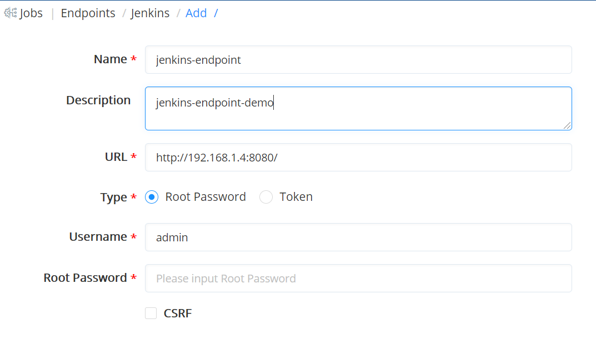
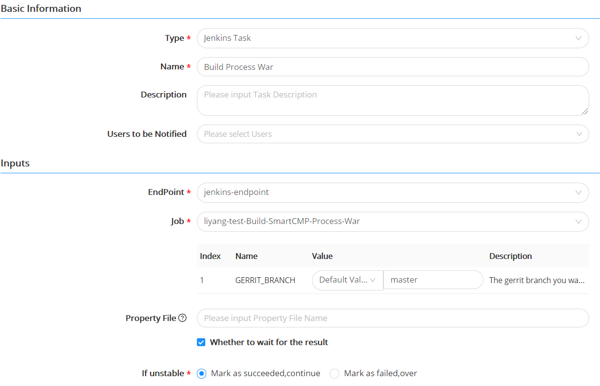

**Endpoints**
# Introduction

Users can add continuous integration systems that need to be connected, such as Jenkins, at Endpoints. Jenkins is an open source, continuous integration (CI) tool with a friendly operation interface, mainly used for continuous and automatic construction/testing of software projects. Jenkins is usually used in combination with version management tools and build tools. Commonly used version control tools include SVN and Git, and build tools include Maven, Ant, and Gradle.

The platform extensively integrates DevOps tool chains including Jenkins, Git, Maven, etc., helping users to efficiently build code, run tests (CI), deploy and update new versions of applications (CD), and are committed to creating virtualized, containerized, and multi-cloud environments in which continuous integration and delivery of applications are adapted to complex business scenarios.

# Steps to Add Jenkins Endpoint {#Steps to Add Jenkins Endpoint}

Click "Jobs"-"Endpoints" in the left navigation bar.
+ Click to add Jekins ednpoint and enter the Jekins server name and address (Jekins server access address). When choosing password in type, enter the user name and password (user name and password to the Jekins backend) otherwise enter the user name and token.
+ Click verify and click submit after successful validation.
>「Note」  Prerequisite: Confirm that the Jekins server is available and configured.

# Associate Endpoints with Jenkins Task
+ Take the scenario of software package building and upgrading as an example. After the user submits the code to the master branch, the latest code is automatically synchronized and jenkins is automatically triggered to package the Process. After the packaging is completed, the software package is transferred to the artifact repository for storage, and then the address of the new package is obtained through the artifact repository analysis task to upgrade current services.
+ As shown in the figure below, in the task details of building the War package, user selects the task type as Jenkins and the name as Build Process War, and associate the successfully configured Jenkins endpoint and Job in the input parameters. After submitting the code to the master branch, the latest code is automatically synchronized and the Build Process War task is automatically executed.

