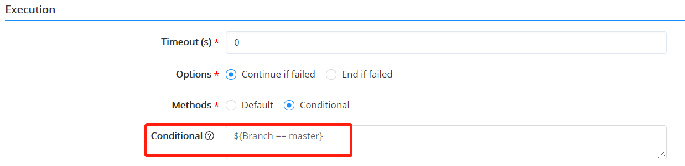

**Pipelines**

# Introduction

The cloud platform's pipeline function integrates DevOps tool chain, combined with component libraries, blueprints and highly customized stages and tasks to build and realize the automatic execution of resources and software delivery process. Build code, run tests (CI), deploy and update new versions of the application (CD). Eliminate human error, provide a standardized feedback loop for developers, and achieve rapid product iteration.

The pipeline consists of a series of stages, and each stage consists of multiple tasks and environments that must be completed before the software is released to production. Currently, it supports the customization and assembly of a variety of stages and tasks, and any number of execution tasks can be added to the stages. Through them, it is possible to design development, deployment, and operation pipelines suitable for various scenarios, helping users build automated, reusable, secure and compliant application continuous delivery and deployment and realizing the full life cycle management of application testing, deployment, update, operation and recycling.

# Components of the Pipeline

+ Stage: Refers to defining different stages according to the needs of the business, and defining tasks to be completed in each stage. For example, different stages such as software packaging and test environment deployment can be defined.
+ Task: specific activities to be performed. System supports custom task types and input and output parameters. The input and output parameters refer to the parameters passed between various tasks in the pipeline. For example, the ID of the newly deployed virtual machine of the previous task is passed to the next task for invocation. The publisher of the pipeline can define the resources and parameters of each task and call them in subsequent tasks. Among them, the task types of each stage include:
    + Wait task: defines the interval time, and waits while executing. Please fill in the waiting time (s) in the input parameter.
    + Service provision tasks: deploys new cloud resources when the job is executed. Please fill in the services (published in the service catalog) and templates in the input parameters.
    + Jenkins task: executes existing jobs on Jenkins, configures Jenkins endpoints and jobs, and customizes build software packages.
    + Cloud resource task: performs operations on the specified cloud resources, such as start and stop, quickly execute scripts, and add to whitelist.
    + Artifact resolving task: analyzes the software artifact package version in the binary artifact repository.

+ Trigger: Customize the trigger conditions of the pipeline. The trigger defines when the pipeline will run automatically. You can manually trigger the pipeline task, or you can set a strategy to automatically trigger the pipeline task. Trigger types include: Webhook integration (supports Git, Gitlab and other code warehouse change triggers), Jenkins trigger, timed trigger, manual trigger, etc.

# Detailed Configuration Steps of the Pipeline

Take the following scenario as an example: automatic building, artifact repository resovling and application upgrading and updating. Developers submit code, trigger Jenkins automatic building, upload the latest War package to the artifact repository to store the latest image package, and then get the address of the latest application package through the artifact resolving task, and finally automatically update the image package in the environment.

## Create a Pipeline

1. In the left navigation bar, click "Jobs"-"Pipelines", and click "Create".
2. On the basic information page, input name, description, project (members of the project can apply for the execution pipeline), and users to be notified (when the execution ends, a notification will be sent to the specified user, provided that the administrator has configured the notification method in the Settings-Notifications, please refer to[Notifications](http://CMP-PUBLIC-IP/help/AdminDoc/09Settings/#Notifications))
3. Global parameters can be added and called in later tasks. On the basic information page, at the parameter list, click the plus button, fill in the name "Branch" and the value "master".
    

## Stages Configuration
After creating and completing the pipeline job and adding basic information, proceed to the stage configuration of the pipeline job:
1. Click "Jobs"-"Pipelines"-"Task" in the left navigation bar, and click the Add button.
2. Enter the name of the stage, for example, Jenkins build, resolve software package, update application environment, etc.
    

## Tasks Configuration{#TasksConfiguration}

### Add Jenkins Tasks
After the Jenkins build stage is created, click the "Add a Serial Task" button.
1. Select the Jenkins task in basic information. Developers submit code to the master branch and call the global parameters configured in the basic information interface. When the branch is master, it triggers Jenkins to automatically synchronize the latest code on the master branch in the development environment.
2. Fill in the endpoint at the input parameters (choose to add the pre-configured Jekins at the endpoint.Select the existing Jobs on Jenkins (These Job tasks are created by the Jenkins account owner on demand in the Jenkins backend.)

       
    
3. Select the property file, which is actually the configuration parameters for customizing the output of the Jenkins task. The specific content of the property file will be written into the output result of the task.
4. Whether to wait for the result: means that proceed to the next stage only until the current Jenkins task is completed. If it is not checked, the task execution will not be affected even if the output result is unsuccessful.
5. Fill in the timeout in the execution settings (for example: set the timeout to 360s, if the task execution time exceeds 360s, it means the task execution failed), Options ("Continue if failed" means executing the next task if the current task fails, while "End if failed" means finishing the pipeline if the current task fails and the pipeline execution fails), Methods (select the default execution, or select the conditional execution. You need to set the conditional execution expression, for example: you can enter the EL expression, refer to the following figure:

    

### Add Artifact Resolving Task
After the Jenkins task is completed, the newly-built image will be saved in Harbor. Through the artifact resolving task, the latest version of the image will be obtained and the application environment will be updated with the new image. It is necessary to create a artifact resolving task to parse the address of the software package in the Harbor artifact repository to obtain the latest image package. Detailed steps as follows:
1. Basic information: select the artifact resolving task and fill in the name to obtain the latest version of the image from Harbor.
2. Input parameters: select the artifact repository endpoint. Note that the endpoint needs to be configured in advance. For specific configuration steps, please refer to [Add Artifact Repository](http://CMP-PUBLIC-IP/help/AdminDoc/06CloudServiceMgmt/ArtifactRepository.html). Users may select: select the repository when the task is being executed; retrieve from context: need to fill in the acquired expression; or default: When docking the Harbor artifact repository, if a artifact repository endpoint is successfully selected, the remaining relevant parameters will be filled in by default.
3. Output parameters. Repository: the repository where the image package is located. Group: the group where the image package is locate. Name: the name of the image package obtained. Version: the version of the image package. Download address: the download address of the image package.
    
In addition to the two typical tasks described in detail above, the cloud platform also supports the creation of more types of tasks, for example: in the application scenario of service deployment and operation integration, when the instance is successfully deployed, obtain the instance ID, Wait for 10 seconds, and then execute the configured operation script for a single/multiple instances.

### Add Service Provision Task
Select the service provision task to deploy a new instance during the job execution. Take the deployment of a instance on the vSphere cloud platform as an example. The selectable service types are derived from the published service cards in the service catalog, and the selectable templates are derived from the request information. The specific steps:
1. Basic information: select the service provision task.
2. Click "Service Catalog" and choose Deploying instances on the vSphere Cloud Platform, enter the "Request Service Details Page", fill in the request parameters, click the "Save" button below, define the template name, and save.
3. In the service provision task details interface, select the de1 template that was just created.

### Add Wait Task
Wait task: defines the interval time, and wait while executing. Fill in the wait time(s) in the input parameter, for example: after waiting 10s, the pipeline will automatically execute the operationscript.

### Add Cloud Resource Task
Select cloud resource tasks to perform operations on the instance resources that have just been successfully deployed, such as batch startup and shutdown of instances, executing operation scripts, and viewing the results. The specific steps are:
1. Basic information: select cloud resource tasks.
2. In the tree structure, select the Resource-IaaS-Machine as cloud resource type, and the specified operation script will be applied to multiple types of instances under the IaaS group.
3. Choose the method. choose the existing cloud resource, the cloud resource you can choose comes from the cloud resource managed by the platform (see the specific steps for cloud resource: click "My Deployment"-"Resources" in the left navigation bar, select Cloud resource type, you can view Machine under the managed IaaS group).
4. You can also select Retrieve from the context. The cloud resource task depends on the service provision task executed before. It supports selecting global parameters or context parameters in the drop-down box of the cloud resource. For example, in the figure below, select machineids under vSphere Server, and select the IDs of all vSphere instances that have been successfully deployed.

5. Associate the configured operation scripts in the operation details. For the configuration steps of the scripts, please refer to [Add Script](http://CMP-PUBLIC-IP/help/AdminDoc/11Jobs/ScriptLibrary.html)
6. In the output parameters, you can understand the cloud resource ID executed under the current cloud resource task, as long as all the IDs of the cloud resources that successfully completed the task and all the IDs of the cloud resources that failed to perform the task. Support customization of which parameters to output.
   

 
## Configure Triggers

Customize the trigger conditions of the pipeline. The trigger defines when to automatically run the pipeline. You can manually trigger the pipeline task, or you can set a strategy to automatically trigger the pipeline task by the trigger. SmartCMP trigger types include: Webhook integration (supports Git, Gitlab and other code library change triggers), Jenkins triggers, timing triggers, manual triggers (that is, triggers when the pipeline job is manually executed), etc.

### Add Timing Trigger
The specific steps to add a timing trigger:
1. Enter the trigger name, CRON as trigger type, and description (optional).
2. Configure the detailed parameters of CRON and select the type of repetition (custom cron expression such as: 0 0 0 * * ?, a certain period of a certain day of the week, a certain period of a certain day of the month, a certain period of the day ).
3. Click Create to configure the trigger. For example: generate a snapshot every day/week/month at 10:10.

### Add Webhook Trigger
Add and configure a Webhook type trigger (triggered when the code is submitted to the Gitlab code repository). When the code is submitted to the Gitlab code library, the state of the library changes, triggering the pipeline. Specific steps:
1. In the left navigation bar, click "Jobs"-"Pipelines", and click Create on the trigger page.
2. Enter the trigger name, type (WEBHOOK), description (optional), the detailed parameter configuration of WEBHOOK is as shown in the figure below.
3. Take Gitlab as an example, add a webhook type trigger in the pipeline. Customize the fields in "Source", for example: "gitlab-test" in the figure below, "gitlab-test" will be automatically spliced ​​to "URL" to form a complete URL link. Note: This complete URL (http://SmartCMPaddress/ops-listener/webhook/gitlab-test) will be used when configuring in Gitlab.
4. Add filter conditions, which are equivalent to password verification. When the administrator does not configure the filter conditions, as long as the URL (http://SmartCMPaddress/ops-listener/webhook/Gitlab-test) is called, the pipeline will be triggered. After adding filter conditions, it is equivalent to adding a password to "webhook trigger".
5. When the URL is called back, the pipeline operation can only be triggered if the password matches successfully. If only Gitlab, Gitlee and Git are supported, the filter conditions only need to set a password to take effect. The key pair method is used to be compatible with more scenarios. Therefore, when adding filter conditions, if the callback party is Gitlab, Gitlee, and Git, the "name" must be fixed as a token, and the "value" supports customization (input password). After configuration, save them in sequence.

6. Specific configuration steps for Gitlab: Open Gitlab. If Gitlab is a newly applied environment, adjust the network configuration to allow the request to be called back locally.

 >「Note」  Configure webhook: create a project, enter project details, click Setting-Integrations in turn, enter the URL address set in advance in WEBHOOK parameter configuration in URL (http://SmartCMPaddress/ops-listener/webhook/gitlab-test), enter the value corresponding to the token configured in the "conditional filter" in the Secret Token (customized value password). Note that do not check Enable SSL verification. Select Add Webhook, and it will be realized when the code is submitted Trigger the function of the pipeline.
   

