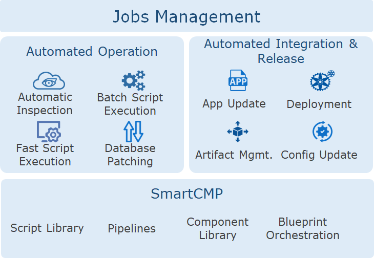

**Jobs**

# Overview

The platform uses the concept of process and automation to assemble fragmented single tasks into an automated pipeline operation, in which each task can be flexibly customized and each stage/task can be used as an atomic node for different projects and systems scheduling, combined with authority control and detailed structure display, to meet users' complex and diverse business use scenarios.

At the same time, the job management function is the platform's integration of automated pipeline and script library functions. In addition to a series of achievable basic operation scenarios such as rapid script execution, batch execution of operation scripts, building software packages, and timed tasks. Through customized stages and tasks, an operation process is made into a complete pipeline, and a wealth of task types are provided to support complex operation scenarios, such as: service deployment and integrated process management, artifact repository analysis and application self-service update, Database SQL automated operation, etc.

#  Scenarios

 + Scenarios for automated operations: Operation personnel can perform quick script execution or batch script execution for any cloud resource. For example: batch inspections of massive instances or databases. Features:
   + Script library unifiedly manages scripts for multiple scenarios.
   + Scripts can be used uniformly for multi-cloud resources and application software.
   + Whether the script is shared with others and the specific parameters of the script can be selected on demand.
   + Scripts can be associated with tasks to flexibly assemble and configure automated pipeline operations.

 + DevOps scenarios: The devops personnel continuously integrate released and customized stages and tasks in the pipeline to achieve the entire process of automation from code submission, building, packaging, artifact repository analysis, deployment or updating to the latest environment, and upgrading applications. Features:
   + Supports continuous integration and release not only in the container environment, but also traditional applications, virtualization, and public cloud environments.
   + Coordination of pipeline jobs with components and blueprints to better manage complex applications.
   +Then pipeline jobs emphasize the unified management of heterogeneous resources, reflecting the powerful, efficient, and easy-to-use features.

