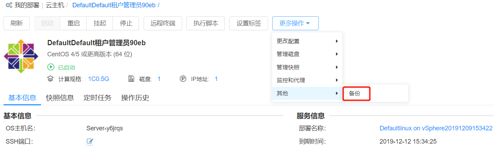

**Instances**

Users can view and manage the instance list according to the following steps. The activation and operation need to be set at the business group level or service configuration level:

+ After selecting “My Deployment” - “Instance” in the left navigation bar, the user will see a list of instances. You can view the instance name, cloud platform, operating system, instance status (started, lost, stopped, etc.), health status, business group, project, service deployment, lease expiration time, retention expiration time, owner, IP address, label, installed software, resource label, etc. Other display columns can be selected by clicking "Show column", or by selecting some columns. Filter by business group, project, owner, status, tag, cloud platform type, whether monitoring is enabled, cloud platform type, whether to install agent, operating system type, whether to import or not.

+ In the instance list, the user can select one or more instances to perform some operations quickly, including “start”, “reboot”, “suspend”, “stop”, “execute script”, “setup tag”, “enable/switch monitor”, "update monitoring agent", "update automation agent". The specific operation introduction will be expanded below

+ You can also click on a instance to enter its details interface for management and operation. The virtual machine details interface includes “Basic Information”, “Operation History”, “Snapshot”, “Monitoring”, “Application List” and the top operation list.

+ “Basic Information” includes some information about the virtual machine and its related hosts, the organization information of the virtual machine in the platform, and the CPU, memory, storage running status, VNC connection information, etc. of the virtual machine.

+ “Operation History” includes the history of operations performed by this virtual machine.

+ “Snapshot” displays the current snapshot information (snapshot name, creation time, etc.), click “Add” to create a snapshot.

+ “Monitoring” includes monitoring data of the virtual machine CPU, memory, disk, and network (you can adjust the time span or average time to view historical monitoring data as needed)

>「Note」Only the VMs that are installed and monitored in the VM template can be seen in the monitoring after the deployment is generated. For details on how to configure the installation monitoring, see the chapter "VM Template".

+ “Application List” displays the list of applications that are currently installed on the virtual machine.

+ Operation list includes a list of operations that can be performed by the virtual machine. The specific operation introduction will be expanded below.

>「Note」Only those virtual machines with the operation permission configured when the business group is set or the service is configured can see the list of allowed operations after the deployment is generated. For details on how to configure the virtual machine operation entitlement, see "Business Group Management" and "Service Configuration".

## Instance Operation{#Instance Operation}

On the instance list interface or click the instance name to enter the instance details page, you can perform the following operations on the instance. The operations are enabled or disabled by the business group/service deployment.

### Startup

The (shut down) virtual machine can be started in real time, or it can be triggered (at some point in the future) by setting "Enable Timing".

### Suspend (vSphere)

The virtual machine that is suspended (on) can be triggered by timing (at some point in the future) by setting "Enable Timing".

Suspending multiple (powered-on) virtual machines can be triggered by timing (at some point in the future) by setting "Enable Timing".

>「Note」only vSphere virtual machines has this option.

### Stop

To stop (i.e., power off) the virtual machine (on the power-on state), you can trigger the task by timing (at some point in the future) by setting "Enable Timing".

### Restart

Restart the virtual machine (on the power-on state) by setting "Enable Timing" and timing (at some point in the future) to trigger this task.

Restart multiple (powered-on) virtual machines, you can trigger this task by setting "Enable Timing" and timing (at some point in the future).

### Execute script 

A script in a script library of virtual machine can be triggered by timing (at some point in the future) by setting "Enable Timing" or by selecting an IP address.

>「Note」If you do not have an agent installed, you must enter the username and password of the virtual machine when executing the script.

### vMotion Migration (vSphere)

Support for compute resource migration and storage migration to vSphere. Use vSphere's vMotion migration feature to migrate virtual machines between different hosts using different migration methods.

-   Calculate resource migration, select the target host, you can trigger this task by setting “Enable Timing” and timing (at some point in the future).

-   Storage migration:

<!-- -->

-   Linked clones: Select Require Storage to migrate the target instance to the selected storage.

-   Full clone: Select the provisioning mode (same source format, thin provisioning, thick provisioning delay zeroing, post provisioning zero); select virtual machine storage policy (retain existing virtual machine storage policy, datastore defaults, and other Define the storage policy); storage (determine the compatibility of the storage according to the selected storage policy, and display the space and proportion of each storage)

-  	Enable Timing: Set the time to trigger this task at some point in the future

>「Note」Only available for vSphere virtual machines. When you migrate storage, you can retain the original provisioning mode and storage policy or modify it.

### Remote terminal

>「Note」OpenStack virtual machine remote terminal operation requires the use of VNC Web Client, your browser needs to support HTML5 Canvas and HTML5 WebSockets. If you need to know all the browsers supported by the VNC Web Client, you can visit https://github.com/kanaka/noVNC/wiki/Browser-support

### WEB Remote Terminal (vSphere)

vSphere's Web console client does not require special browser support.

>「Note」Only available for vSphere virtual machines.

### Set the Instance Label

>「Note」Allow each user to set a label for the instance without requiring an administrator to configure an operating license.

Key tags can be set for instances to classify and filter instances.

The instance label is used as follows:

Add tags

Add tags to the newly created instance:

1.  Select Deployments - Instance in the left navigation bar. On the instance list interface, select an instance.

2.  Click “More Actions” above, “Set Label”, the setting interface of the key value label appears.

3.  Fill in the key, value, click "Create" "Execute", the label is created successfully; you can also select the existing label, click "Execute". In the right column of the instance list, you can view the added instance label.

Add tags to imported instances:

1.  In the left menu, select “Infrastructure”, click “Resource Bundles”, select a resource bundle, and enter the Edit Resource Bundle interface.

2.  Go to the “Instance” page and click “Import” 

3.  Click the input box after “Label” to pop up the key value label creation page, enter the key value, create a new label, or select the existing label.

Modify/Delete Label:

On the instance list interface, select a instance; click “Set Label” to display the key label of the instance, which can be directly deleted and re-created.

 

### Add a new disk

Add a new disk to the virtual machine, which can be triggered (at some point in the future) by setting "Enable Timing".

>「Note」Cannot be performed in the suspended state

### Extend Disk

To extend an existing disk to a virtual machine, you can trigger the task by timing (at some point in the future) by setting "Enable Timing".

>「Note」Support expansion through the cloud management platform or the disk created in the previous section. This operation cannot be performed in the suspended state.

### Delete a disk

Delete a disk other than the system disk on the virtual machine, including the disk added by the service configuration or the disk added by the operation.

### Add a New Logical Volume

Add a new logical volume to the Linux virtual machine, which can be triggered (at some point in the future) by setting "Enable Timing".

>「Note」Cannot be performed in the suspended state

### Expand Logical Volumes

To extend an existing logical volume to a Linux virtual machine, you can trigger this task by timing (at some point in the future) by setting "Enable Timing".

>「Note」Support extensions that are deployed through the cloud management platform or created in the previous section. This operation cannot be performed in the suspended state.

### Adjust the configuration

Adjust the configuration (vCPU, memory) of the virtual machine or container node and click Submit.

### Add a Network Card

Add a new NIC, take effect for all instances of the compute node, select the network label and IP allocation mode. At present, vSphere only supports DHCP. OpenStack and PowerVC support two IP allocation modes: DHCP and IP pool. OpenStack instance also supports manual IP assignment. 

### Delete a network card

Delete the newly added NIC of the operation and maintenance, which will affect all instances of the node.

### Mount NFS 

Mount an NFS (Network File System) to the virtual machine, which can be triggered (at some point in the future) by setting "Enable Timing".

>「Note」This operation is available only when the NFS cloud platform and resource bundle are configured.

### Update the instance display name

Click "Update Instance Display Name" to reset the display name of the instance.

### Reset the Operating System Host Name

Click "Reset OS Hostname" to reset the operating system hostname.

>「Note」Windows operating system can only perform this operation if the agent is installed.

### Enhance Linux User Permissions

Temporarily give a Linux user a Sudo privilege (free secret) for a while. If the instance has an automated agent installed, simply enter the username and permission usage time. If the instance does not have an automated agent installed, enter the administrator username and password (or select a key pair) and select an IP address.

### Reset Password

Click "Reset Password" to reset the new password for the virtual machine.

### Application level lifecycle operations

In the detailed interface of the instance, there is an application tab with a list of applications belonging to the instance. When an application is selected, the life cycle operation of the application appears, and the operations include "start", "stop" and "custom" operations.

### Create a Snapshot

When creating a snapshot, set a timed loop task, for example, automatically create a snapshot at a certain time every day, every week, or every day of the month, and support to view and cancel the timed loop that has been set at any time.

1. In the left navigation, select “Deployments” - “Instance” and select “Snapshot Information” on the right.

2. Click the “Add” button to fill in the timed loop information.

3. Click Submit, and the task of creating a snapshot periodically is set successfully.

4. In the left navigation, select “Deployments” - “Instance” and select “Timed Task” on the right.

5. Select the operation name and click Delete above to cancel the scheduled loop task.

### Revert to Snapshot (vSphere)

To restore a virtual machine to a previous snapshot, you can trigger this task by setting "Enable Timing" and timing (at some point in the future).

>「Note」Only available for vSphere virtual machines.

### Delete a Snapshot

Delete created snapshot

### Execute a Snapshot Policy

A snapshot policy is executed for a single disk under the instance of Aliyun, and the snapshot policy is created in the Aliyun platform.

### Cancel a Snapshot Policy

Cancel the snapshot policy for a single disk under the instance of Aliyun.

### Add an automated agent

If the instance does not have an automated agent installed, you can install it by: entering the username and password/key pair with SSH and administrator privileges, and clicking "Execute" after the input is complete. If the port is not entered, you need to enter the port number in the instance details page, "SSH port".

### Update an Automation Agent

If the instance has an automated agent installed, it can be updated with this action.

### Enable/Switch Monitoring

Currently, two monitoring methods are supported for the vSphere instance: built-in agent monitoring and cloud platform monitoring. Built-in agent monitoring includes pre-installed monitoring agent and WinRM/SSH monitoring agent (WinRM for Windows operating system, SHH for Linux operating system). Ccloud platform monitoring refers to reading monitoring data of virtual machine directly from vCenter and there is no need to install a monitoring agent.

Only built-in monitoring agents are supported for the OpenStack cloud platform.

### Update Monitoring Agent

If the instance has built-in agent monitoring installed, it can be updated through this operation.

### Others

Support customize operations according to actual needs. Click "More Operations"-"Others" to display a list of customized operations. For example, the following figure customizes the backup operation for the virtual machine of the vSphere cloud platform. For the detailed steps of the custom operation, please refer to: Action Configuration

