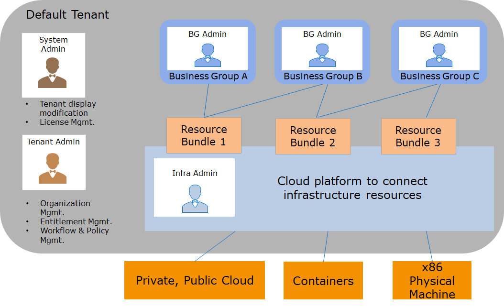
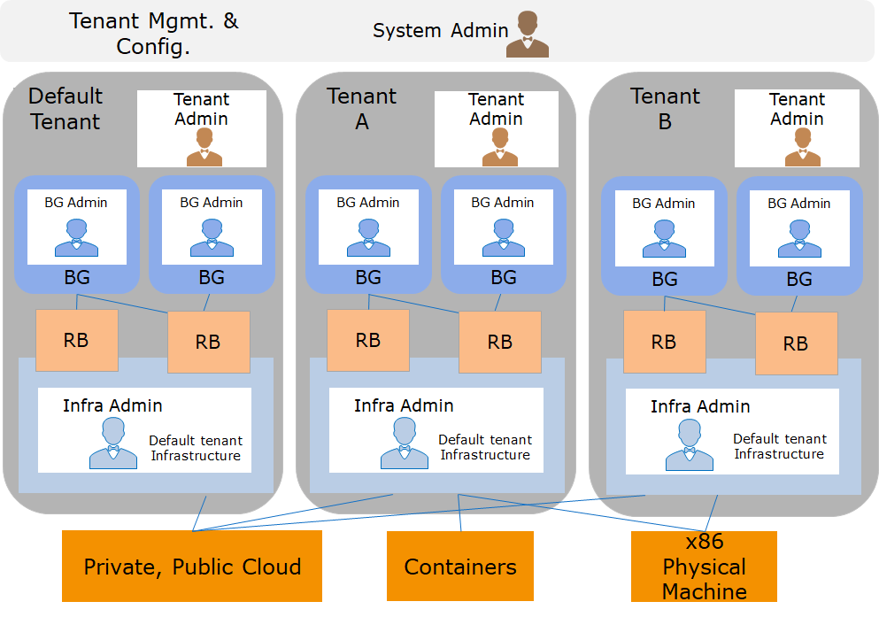
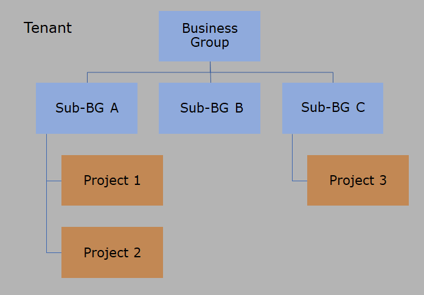

 **Organization**
 
The Organization configures each tenant with a separate organizational structure, including business groups, projects, and more. Tenants are the architectural units in SmartCMP. In a SmartCMP deployment, multiple tenants can be configured. Tenants provide isolation boundaries for resource usage and management configurations. The dedicated configuration in each tenant is listed below:

+ Logo and theme color: Different logo and theme color schemes can be customized for each tenant and configured in the management control interface.

+ User: Each tenant has independent user management. You can create a local user while users of tenant A can only access tenant A and cannot access other tenants. You can also configure each tenant with a directory service for authentication, like Microsoft Active Directory or another LDAP server. Multiple tenants can use the same directory service, but the same user can belong to only one tenant, and users with the same ID cannot be configured in different tenants.

+ Entitlement: Each tenant has an independent entitlement configuration. The permissions configured in tenant A are limited to the scope of tenant A and do not work for other tenants.

+ Workflow: Each tenant administrator can configure workflows, such as approval processes, service processes, etc., to be applied within the scope of this tenant.

+ Cloud platform management and resource bundle configuration: Each tenant admin or infrastructure admin can connect and manage the cloud platform portals required for the tenant, such as VMware vCenter, AWS/Azure/Alibaba cloud, etc. You can configure and manage different cloud platform portals in different tenants, or you can share the same cloud platform portals by configuring different resource bundles to access different computing resources (for example, different clusters in vCenter) for users in different tenants.

+ Service Catalog: Each tenant's architect can design a service blueprint for the tenant. The administrator publishes the service catalog that the user can self-request according to different departments and environments. Categories and service items in the service catalog remain independent among different tenants.

# Tenant

## Single tenant and multiple tenants

### Single tenant

In single tenant deployment, all configurations appear in the default tenant. Administrators can manage cloud resources and organizational structures and configure specific service catalogs within tenants.

### Multiple tenants

In multi-tenant environment, each tenant has a separate configuration that is managed by the administrator. System administrators can configure, view and manage configurations in multiple tenants.

#  Business group and projects

Within each tenant, different organizational structures may be created including business groups and projects.

##  Business group 

A business group is a logical organizational structure within a tenant. User can creates a corresponding business group for a company's department, organization, or business unit. Tenant administrators can create multi-level business groups, and users associated with business groups can use resources and services in the business group.

Independent rules, processes, and resources can be configured for each business group:

+ Associate one or more resource bundles with each business group

+ Associate users with each business group.

+ Configure different approval processes, operation permissions, cloud resource usage leases, cloud resource naming specifications, etc.

##  Project

In SmartCMP, cloud resources within a project are visible to all members of the project and are invisible to all members of other projects.

A project is subordinate to a business group and can contain multiple users. A user can join multiple projects.

# Role
A role consists of a set of permissions that can be associated with a user to determine the functions that the user can manage, configure, and use in SmartCMP. Based on individual responsibilities, each user can be associated with one or more roles, and the permissions will be a superposition of those roles.

After deployment of SmartCMP, following roles will be provided by default:

##  Tenant roles overview

A tenant-wide role has the corresponding responsibilities of that particular tenant and does not affect other tenants in the system. You can create custom roles as needed to be associated with users.

###  Tenant Admin 

Usually responsible for the overall tenant structure. Tenant administrators configure SmartCMP based on their tenants' internal organizational needs, responsible for tenant internal process and policy configuration, organizational structure configuration, user and permission configuration, and more.

Main duty:

+ Create and manage users and tenant roles, assign roles and permissions to users and create service teams

+ Create and manage business groups and assign business group administrators to each business group

+ Create and manage service processes and approval processes

+ Perform tenant system configuration, including catalog service information, mail system information, access to dashboards and reports, etc.

### Software Architect 

Usually responsible for designing services that companies and organizations need to apply for and use. Services come in a variety of styles, from a single virtual machine to complex applications including network load balancing, web applications, and databases.

Main duty:

+ Create and manage software components

+ Create and modify blueprints, model them according to business needs, and define the components included in the blueprint, including infrastructure components and software components 

+ Publish a blueprint

+ Unpublish and delete blueprints that need to be removed

###  Infrastructure administrator

The infrastructure administrator connects one or more cloud platforms to each tenant, manages virtual machine templates (that is, operating system images) in the cloud platform, and calculates specifications (that is, instance types). Create a resource pool, specify the infrastructure resources of each cloud platform, and assign them to the business group for use. At the same time, according to the blueprint designed by the software architect, infra admin can make configurations for different business groups or environment requirements and publish to service catalog.

Main duty:

+ Connect cloud platform

+ Create and distribute resource bundles and manage cloud platform and inventory cloud resources

+ Configure and manage VM templates (that is, operating system images) of the cloud platform and computing specifications (that is, instance types).

+ Manage IP address pool

+ Configure and publish services based on blueprints released by software architects

+ Manage service catalog

+ Analyze resource utilization and recycle expired resources

##  Business group roles overview

A role on a business group scope has the corresponding responsibilities of that particular business group and does not affect other business groups.

### BG admin

Manage one or more business groups, usually department managers.

Main duty:

+ Add users to business group and associate roles

+ Configure policies such as lease duration and naming specification for cloud resources

+ Configure business group cloud resource operation entitlement and service deployment operation entitlement, specify the operations that the user can perform (such as powering on and off, adding disks, adjusting configuration, etc.) and the required approval process

+ Create a project and assign a project administrator

+ Monitor resource utilization in the business group. If resources are scarce, you can apply for resource expansion

### BG member

All users in a business group can request services published to the business group (including services shared to all business groups). Users can request services from the service catalog and manage the resources they own.

Main duty:

+ Self-service request.

+ Check configuration and monitoring information of owned cloud resources to perform self-service operation (the operation entitlement is configured by business group).

+ Self-service alert setting for the cloud resources it owns.

## Project roles overview

A role on a project scope has the corresponding responsibility for that particular project and does not affect other projects.

### Project Admin

Manage one or more projects, usually project managers.

Main duty:

+ Add users to the project and associate roles

+ View cloud resources owned by the project

### Project member

Project member is also a member of the business group to which the project belongs, so it can request publishing services to the business group and can view resources and perform operations. At the same time,all members of the same project can view the resources in this project.

# Service Group

Service group is a collection of service personnel who process request services during the request service management process. Tenant administrators can create one or more service groups and assign members to each service group.

Main duty:

+ After the user applies for the manual work order service that needs manual intervention through the service catalog, according to the pre-configured service process, the corresponding service group will receive the work order for processing.

+ After receiving the work order, the personnel in the service group can transfer, or perform offline processing, update the work order status after completing the task, and return the work order to the request user for confirmation and closure.

