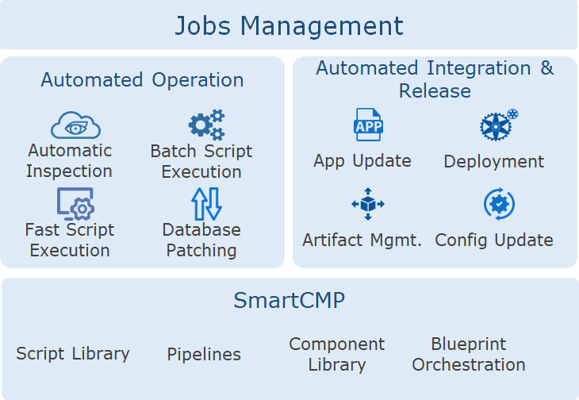
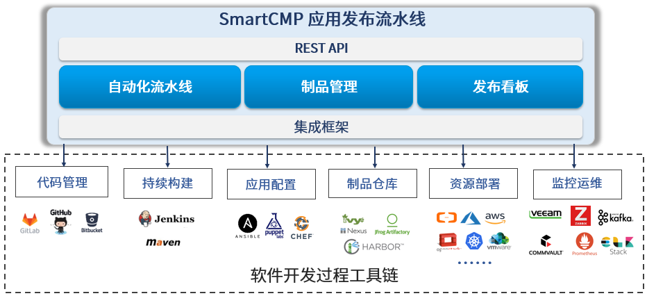
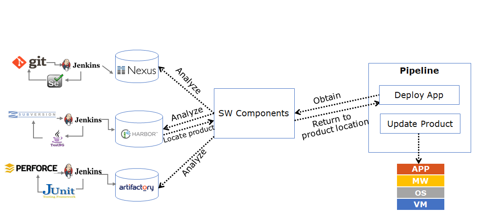
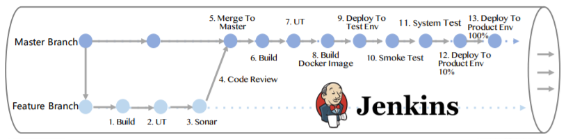
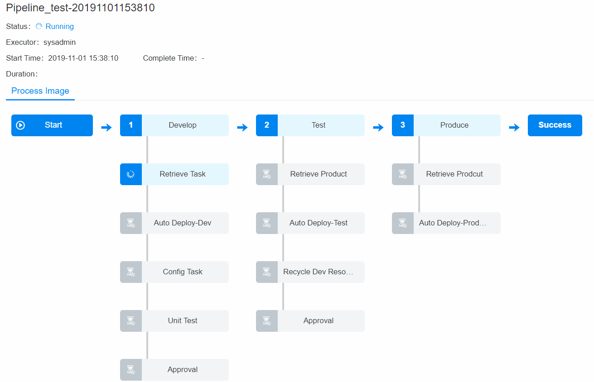

**Jobs Management**

# Concept
The platform uses the concept of process and automation to assemble fragmented single tasks into an automated pipeline operation. Each stage and task can be used as an atomic node for flexible configuration, and provide a variety of trigger mechanisms, combined with access control and detailed structure display, to meet users' complex and diverse business use scenarios.

At the same time, the pipeline can be used in conjunction with the script library function of the platform to support complex operation automation, application integration and release automation scenarios, such as: service deployment & operation process management; artifact resolving & application self-update; Database SQL automated operation and so on.

# Scenarios

## Application Integration and Release Automation

SmartCMP provides enterprises with continuous integration of agile software development, based on IT automation, continuous integration (CI) and continuous deployment (CD) to optimize product development (DEV), testing (QA), system operation (OPS) and other links. The software industry is increasingly aware that in order to deliver software products and services continuously, efficiently, and reliably, DevOps must work closely together to automate software lifecycle management through automated tool collaboration and communication. The core scenarios include:

+ By setting up stages and tasks to automate the packaging of applications, environment deployment, automated testing, etc., configure an automated pipeline for continuous release and continuous deployment that is suitable for the characteristics of the development team. The SmartCMP Application Release Pipeline works seamlessly with continuous integration tools such as Jenkins, Git, and Nexus to automate application deployment and upgrades, and achieve continuous delivery and deployment from development to testing to production.

+ Based on the blueprint, automate the deployment of each application topology blueprint and let the platform automate the triggering of pipelines and execution releases, test, manage product and automate deployment based on policy. Support the deployment of any application to any cloud to open up development, testing, and production environments. Automate online or update applications in production environments with proven architectures, programs, and deployment tools to ensure consistency of cross-cloud deployments and changes, reducing deployment and operational risk.

+ Deployment automation integrates the entire tool chain from an application-centric perspective (automatically completes software development projects including continuous builds, application configuration, product archiving, resource deployment, monitoring operations, etc.), manages and visualizes candidate versions deployment for the entire pipeline, quickly getting the right product deployment to the appropriate environment, thus building a bridge between Dev and Ops.

+ R&D and testers self-apply for cloud resources or services through the SmartCMP service catalog, reducing the time lost in collaboration between DevOps, enabling teams to work together, iterate functions and release products more efficiently. 

## Operation Automation

The platform's automated operation functions are truly oriented to enterprise operation departments, relying on highly customizable scripts, pipeline stages and tasks to provide batch operations on any cloud resource, and repeated execution capabilities, which can meet almost all automated operation of enterprises demand.

Specifically, it includes: single script execution or batch script execution of virtual machines (or any cloud component, such as VM, network, database, middleware, etc.).Provide pipeline execution, capable of programming multiple scripts, or script and file distribution, rr script and component installation sequence and parameter transfer. Timing operations for script execution and job execution. Post-operations after service deployment is configured, that is, the corresponding script execution or job execution, for example, after the instance is successfully deployed, perform batch start and stop operations of instances. All types of operations have history records, which include detailed information and is convenient for post-checking and auditing.

# Script Library

Script: Refers to tools or commands that can be run on the terminal. The platform supports scripts such as Shell, Perl, Bat, PowerShell, Python, and SQL.

Script library: The administrator creates and manages a large number of scripts in a unified manner. Supports the creation of shared scripts according to business needs for authorized business group members of certain roles to directly reference in any scenario.

Standardly manage scripts applicable to multiple environments on a unified platform interface. Support direct creation, editing and deletion of scripts, as well as quick search for newly created scripts and sharing the scripts to designated business groups and roles.

At the same time, users can flexibly choose the type of cloud resources that adapt to the script (such as instance, database, middleware, network, storage, etc.). For example: Create a MySQLCheck script to check database parameters. You can specify the cloud resource type to be executed by the script as RDS under Software and RDS under PaaS. After the script is executed, you can view the detailed log information of the script execution in the execution history. 

# Pipeline

SmartCMP automated pipelines create automated, reusable, secure, and compliant application delivery processes, custom configuration builds, deployments, and end-to-end process governance and control. 
The pipeline is automated, distributed across different environments and stages and achieves full lifecycle deployment and release management. 
Both the definition of the pipeline and the execution of the pipeline provide a friendly interactive interface. The configuration of the pipeline can be mastered through simple practice. The pipeline process can also be intuitively sensed during the pipeline operation. 
The pipeline consists of a series of stages, each consisting of multiple tasks and environments that the software must complete before it is released to production, describing the operations that need to be performed in order to achieve the desired results.
Pipelining is built in successive stages that contain one or more parallel or serial tasks.

The entire pipeline is defined as follows:

+ Add a pipeline, bind a project, and add global parameters to call in later tasks

+ Customize the trigger condition of the pipeline, like when the pipeline is automatically run. You can manually trigger the pipeline task or set the policy to trigger the pipeline task automatically by the trigger to achieve flexible pipeline trigger conditions. Trigger types include Jenkins triggering, Webhook integration (support Git, Gitlab and other code repository to change triggers), manual triggering and timing triggering.

+ Define stages and tasks based on business needs.

## Stage
A stage is a group of tasks that are parallel or serial. When the current stage of the task meets the rules and execution is completed, it is promoted to the next stage in the pipeline. SmartCMP pipeline supports the customization and assembly of multiple stages and tasks and can add any number of execution tasks in the stage through which it is possible to design development, deployment, and operation pipelines applicable to various scenarios. Based on the secondary development capabilities of SmartCMP, you can expand your needs for more personalized scenarios. The stages are divided into several types, including:

+ Code compilation stage: build binary files.

+ Unit testing stage: Run all unit tests and analyze code quality, such as: development, functional testing, user acceptance testing (UAT), load testing (LT), system integration testing (SIT).

+ Packaging stage: Build the final package, virtual machine image or Docker image.

+ The parameters of the input and output and the execution time can be defined during the execution of the stage task, and the stage can be enabled under the specified conditions.

For example, you can define different stages of software packaging, deployment of test environments, and so on. The task types for each stage include Jenkins Job tasks, deploying new application tasks, cloud resource change tasks, script execution tasks, etc.
After the pipeline is executed, user can view the execution status of each stage and task, as well as output information.

## Task

Each stage of the task is an activity or job in the software development process, which can be to acquire artifacts, automate deployment, run unit tests, create tasks, run custom workflows or scripts, etc. 

The task definitions for the SmartCMP pipeline include:

+ Custom task types: Jenkins Job tasks, new application deployment tasks, cloud resource change tasks, application update tasks, script execution tasks, and other custom tasks;

+ The publisher of the pipeline can define the input and output parameters for each task and make calls in subsequent tasks.

For example, through a blueprint deployment task, it supports deploying any new application to various rich environments such as Windows, Linux, and K8s containers, that is, it can automatically trigger a published cloud resource service to deploy cloud resources. Tasks can automate cloud resource changes and operations, and upgrade and update application software. Relying on the standard operation module and the underlying capabilities of the SmartCMP platform, you can design a variety of complex operation scenarios to meet the needs of large-scale deployment and massive operations

## Trigger

Customize the trigger conditions of the pipeline. The trigger defines when to automatically run the pipeline. You can manually trigger the pipeline task, or set a strategy to automatically trigger the pipeline task by the trigger. Platform trigger types include: Webhook integration (support Git, Gitlab and other code library change triggers), Jenkins trigger, timing trigger, manual trigger, etc.

# CI/CD Tool Chain

SmartCMP integrates a rich CI/CD toolchain to provide code management, continuous build, product management, deployment, monitoring and operation, and more for applications, and provides an open API. All features are based on a comprehensive integration framework that includes mainstream software tools: GitLab, GitHub, Jenkins, Maven, Ansible, Puppet, Chef, Nexus, Kafka, etc., enabling developers to have more efficient code management and operators to change the application with less risk, improving the quality of the application and reducing the risk of deploying features.

## Artifact Repository

+ Artifacts, often referred to as binary software artifacts, are the output of the build process, including software packages, test reports, application configuration files, etc. which can be run directly or can be viewed in binary form on the server.

+ Artifact management is the management of the artifacts generated during the software development process and is generally released and delivered as the final deliverable. All artifact packages and dependent components can be integrated into the product library for unified management. The product library should be the only source of trusted artifacts for testing and production deployment.

+ Different production languages produce different ways of acquiring, using, and sharing artifacts. Different product libraries can manage binary artifacts of their respective language types.

SmartCMP embeds the leading binary artifact management repository Nexus into the code stream. Development organizations typically build artifact management systems for each project to make it easier and more convenient to acquire artifacts and to achieve good performance for transferring large artifacts over the network. 
Although developers use different types of code to develop build tools and testers use different types of test tools, software artifact management systems specify warehouse types and artifact locations and handle all the complexities of getting the latest and correct artifacts, reduce the complexity of the creation of automated pipeline releases and quickly get the right artifacts to improve deployment efficiency.

## Endpoint

At the endpoint, user can add continuous integration systems that need to be connected, such as Jenkins. Jenkins is an open source, continuous integration (CI) tool that provides a friendly operation interface, mainly used for continuous and automatic construction/testing of software projects. Jenkins is usually used in combination with version management tools and build tools. Commonly used version control tools include SVN and Git, and build tools include Maven, Ant, and Gradle.
The platform integrates Jenkins tools to help users efficiently build codes and automate tests, committed to creating applications of continuous integration (CI) in a virtualized, container, and multi-cloud environment to adapt to complex business scenarios. The following figure shows the role Jenkins can play in the continuous integration process of the application.

## Execution History
Through the execution history, you can view the execution status, executor, execution time, and detailed information of each stage task execution. 

The task schedule will be displayed in the history details. If the task is executed successfully, it will be displayed in green, and if it fails, it is displayed in red. The interface of cloud resource for which the script is executed also displays the execution result, success or failure. In the cloud resource, you can view the name, IP, and status of the instance and click to display the execution result. Support quick search of cloud resources, and filter by status.

The following figure shows the execution of a complex pipeline:

